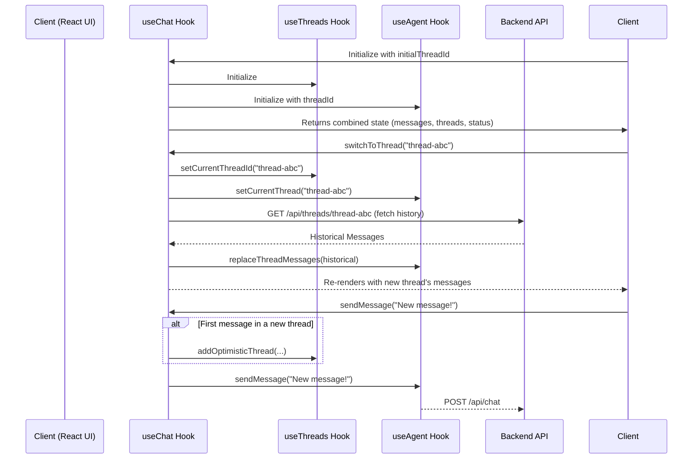

import { Card, CardGroup } from "nextra/components";

The `useChat` hook is the recommended, high-level hook for building chat applications with AgentKit. It seamlessly combines the functionality of `useAgent` (for real-time conversation state) and `useThreads` (for managing the list of conversations) into a single, easy-to-use hook.

`useChat` is designed to handle all the complex coordination between real-time events, thread management, and data persistence, providing a simple and powerful API for building rich, multi-threaded chat interfaces.

<CardGroup>
  <Card
    title="use-agent Example"
    href="https://github.com/inngest/agent-kit/tree/main/examples/use-agent"
  >
    Find the complete source code for a Next.js chat application using `useChat`
    on GitHub.
  </Card>
</CardGroup>

## How it Works

`useChat` acts as an orchestrator, composing the `useAgent` and `useThreads` hooks and managing the state synchronization between them.

1.  **Composition**: `useChat` initializes both `useThreads` to manage the list of conversation threads and `useAgent` to handle the real-time messages for the currently active thread.
2.  **Thread Synchronization**: It keeps the `useAgent` hook's active `threadId` in sync with the `currentThreadId` from `useThreads`. When you switch threads, `useChat` tells `useAgent` which conversation to listen to.
3.  **Smart History Loading**: When switching to a thread, `useChat`'s `switchToThread` function fetches the historical messages for that thread. It then intelligently reconciles this history with any optimistic messages that might already be in the `useAgent` state, preventing data loss and UI flashes.
4.  **Optimistic Updates**: When a new conversation is started, `sendMessage` automatically calls `useThreads`'s `addOptimisticThread` function, so the new chat appears in the sidebar immediately without waiting for a full backend roundtrip.
5.  **Unified API**: It exposes a clean, unified API that combines the most important state and actions from both underlying hooks, hiding the implementation details of their coordination.

### Sequence Diagram



## Usage Guide

`useChat` is designed to be the primary hook for your chat components. It provides everything you need out of the box.

```tsx title="components/chat/Chat.tsx"
"use client";

import { useChat } from "@/hooks/use-chat";
import { ThreadSidebar } from "./sidebar/DesktopSidebar";
import { ConversationArea } from "./ConversationArea";
import { TEST_USER_ID } from "@/lib/constants";
import { useRouter } from "next/navigation";

export function Chat({ threadId: initialThreadId }: { threadId?: string }) {
  const router = useRouter();

  const {
    // Thread management state and actions
    threads,
    threadsLoading,
    currentThreadId,
    createNewThread,
    deleteThread,

    // Message management and agent state
    messages,
    sendMessage,
    status,
    isLoadingInitialThread,
    error,
  } = useChat({
    userId: TEST_USER_ID,
    initialThreadId,
    debug: true,
  });

  const handleNewChat = () => {
    const newThreadId = createNewThread();
    router.push(`/chat/${newThreadId}`);
  };

  const handleThreadSelect = (threadId: string) => {
    router.push(`/chat/${threadId}`);
  };

  return (
    <div style={{ display: "flex", height: "100vh" }}>
      <ThreadSidebar
        threads={threads}
        loading={threadsLoading}
        currentThreadId={currentThreadId}
        onNewChat={handleNewChat}
        onThreadSelect={handleThreadSelect}
        onDeleteThread={deleteThread}
      />
      <ConversationArea
        messages={messages}
        status={status}
        onSendMessage={sendMessage}
        isLoading={isLoadingInitialThread}
        error={error}
      />
    </div>
  );
}
```

## API Reference

### Configuration

`useChat` accepts a configuration object with the following properties:

<ParamField path="userId" type="string">
  The identifier for the current user. Defaults to a test ID.
</ParamField>

<ParamField path="initialThreadId" type="string">
  The ID of the thread to load when the component first mounts.
</ParamField>

<ParamField path="debug" type="boolean">
  Enables detailed console logging for both `useAgent` and `useThreads`.
</ParamField>

### Return Value

The hook returns a single object containing all the state and actions needed to build a complete chat UI.

#### Agent & Message State

These properties are shortcuts to the state of the currently active thread from the underlying `useAgent` hook.

<ParamField path="messages" type="ConversationMessage[]">
  The array of messages for the currently active conversation.
</ParamField>

<ParamField path="status" type="AgentStatus">
  The real-time status of the agent for the active thread (`"idle"`,
  `"thinking"`, etc.).
</ParamField>

<ParamField path="isConnected" type="boolean">
  `true` if the client is connected to the real-time event stream.
</ParamField>

<ParamField path="error" type="object | undefined">
  An error object if the active thread has encountered an error.
</ParamField>

#### Thread Management State

These properties come from the underlying `useThreads` hook.

<ParamField path="threads" type="Thread[]">
  The array of all conversation threads for the user.
</ParamField>

<ParamField path="threadsLoading" type="boolean">
  `true` when the list of threads is being fetched.
</ParamField>

<ParamField path="currentThreadId" type="string | null">
  The ID of the currently selected conversation thread.
</ParamField>

<ParamField path="isLoadingInitialThread" type="boolean">
  `true` specifically when the `initialThreadId`'s history is being loaded on
  mount.
</ParamField>

#### Unified Actions

These are wrapped action functions that handle all necessary state coordination.

<ParamField path="sendMessage" type="(message: string) => Promise<void>">
  Sends a message to the currently active thread and handles optimistic UI
  updates for new threads.
</ParamField>

<ParamField path="createNewThread" type="() => string">
  Creates a new, empty thread, makes it the active thread, and returns its new
  ID.
</ParamField>

<ParamField path="switchToThread" type="(threadId: string) => Promise<void>">
  Switches the active conversation to the specified `threadId` and handles
  loading its message history. **Note**: In a URL-driven app, you'll typically
  just navigate to the new URL instead of calling this directly.
</ParamField>

<ParamField path="deleteThread" type="(threadId: string) => Promise<void>">
  Deletes a thread from the backend and optimistically removes it from the UI.
</ParamField>
