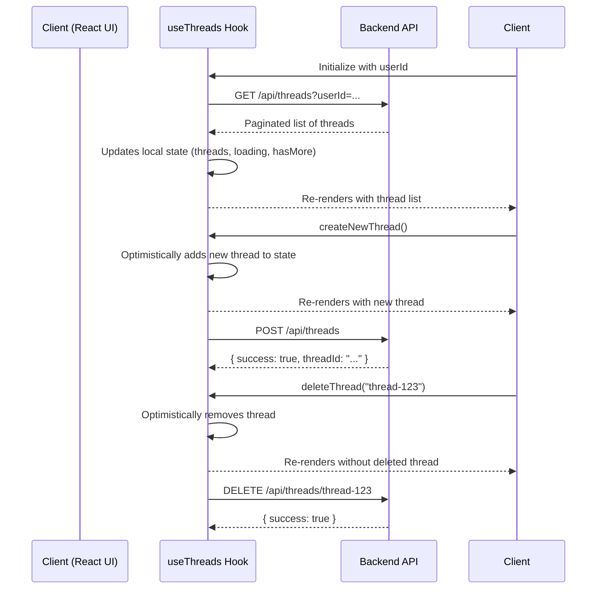

import { Card, CardGroup } from "nextra/components";

The `useThreads` hook is a client-side utility for managing a list of conversation threads. It handles the data-centric aspects of a chat application, such as fetching, creating, deleting, and paginating conversation histories.

While `useAgent` manages the real-time event stream for individual conversations, `useThreads` manages the list of all conversations, providing the data needed for features like a chat history sidebar. It's designed to be used in conjunction with `useAgent`, often composed together in a higher-level hook like `useChat`.

<CardGroup>
  <Card
    title="use-agent Example"
    href="https://github.com/inngest/agent-kit/tree/main/examples/use-agent"
  >
    Find the complete source code for a Next.js chat application using
    `useThreads` on GitHub.
  </Card>
</CardGroup>

## How it Works

`useThreads` is a data-fetching and state management hook that interacts with a set of backend API endpoints to manage conversation thread metadata.

1.  **Initialization**: The hook is initialized with a `userId`. On mount, it triggers an initial fetch to the backend.
2.  **Fetch Threads**: It makes a `GET` request to a list endpoint (e.g., `/api/threads?userId=...`) to retrieve a paginated list of thread metadata (ID, title, last update time, etc.).
3.  **State Management**: It stores the list of threads, loading status, pagination state (`hasMore`), and any errors in its local React state.
4.  **User Actions**:
    - `createNewThread`: Makes a `POST` request to `/api/threads` to create a new, empty thread in the database and then optimistically adds it to the local state.
    - `deleteThread`: Makes a `DELETE` request to `/api/threads/[threadId]` and optimistically removes the thread from the local state.
    - `loadMoreThreads`: Fetches the next page of threads from the list endpoint, appending them to the existing list.
5.  **Synchronization**: It provides a `currentThreadId` and a `setCurrentThreadId` function to keep track of the currently active conversation, allowing parent components to sync this state with other hooks like `useAgent`.

### Sequence Diagram



## Usage Guide

### 1. Backend Setup

You need API endpoints to list, create, fetch, and delete threads. The `use-agent` example uses a `PostgresHistoryAdapter` to interact with the database.

#### List and Create Threads

```ts title="app/api/threads/route.ts"
import { NextRequest, NextResponse } from "next/server";
import { PostgresHistoryAdapter } from "@/inngest/db";

const historyAdapter = new PostgresHistoryAdapter({});

// List threads for a user with pagination
export async function GET(req: NextRequest) {
  const { searchParams } = new URL(req.url);
  const userId = searchParams.get("userId");
  const limit = parseInt(searchParams.get("limit") || "20");
  const offset = parseInt(searchParams.get("offset") || "0");

  const data = await historyAdapter.listThreadsWithPagination(
    userId,
    limit,
    offset
  );
  return NextResponse.json(data);
}

// Create a new thread
export async function POST(req: NextRequest) {
  const { userId } = await req.json();
  const { threadId } = await historyAdapter.createThread({
    state: { data: { userId } },
  });
  const title = "New Conversation";
  return NextResponse.json({ threadId, title });
}
```

#### Get, Delete, and Update a Specific Thread

```ts title="app/api/threads/[threadId]/route.ts"
import { NextRequest, NextResponse } from "next/server";
import { PostgresHistoryAdapter } from "@/inngest/db";

const historyAdapter = new PostgresHistoryAdapter({});

// Get a single thread's history
export async function GET(
  req: NextRequest,
  { params }: { params: { threadId: string } }
) {
  const messages = await historyAdapter.getCompleteHistory(params.threadId);
  // ... logic to get thread metadata
  return NextResponse.json({ thread, messages });
}

// Delete a thread
export async function DELETE(
  req: NextRequest,
  { params }: { params: { threadId: string } }
) {
  await historyAdapter.deleteThread(params.threadId);
  return NextResponse.json({ success: true });
}
```

### 2. Frontend Setup

Use the `useThreads` hook to build a sidebar component that lists conversations.

```tsx title="components/ThreadSidebar.tsx"
"use client";

import { useThreads } from "@/hooks/use-threads";

const USER_ID = "test-user-123";

export function ThreadSidebar({ onThreadSelect, currentThreadId }) {
  const { threads, loading, hasMore, error, loadMore, createNewThread } =
    useThreads({ userId: USER_ID });

  const handleCreateAndSelectThread = async () => {
    const newThreadId = await createNewThread();
    onThreadSelect(newThreadId);
  };

  if (error) {
    return <div>Error loading threads: {error}</div>;
  }

  return (
    <div className="sidebar">
      <button onClick={handleCreateAndSelectThread}>+ New Chat</button>
      <ul className="thread-list">
        {threads.map((thread) => (
          <li
            key={thread.id}
            className={thread.id === currentThreadId ? "active" : ""}
            onClick={() => onThreadSelect(thread.id)}
          >
            {thread.title}
          </li>
        ))}
      </ul>
      {loading && <div>Loading...</div>}
      {hasMore && !loading && <button onClick={loadMore}>Load More</button>}
    </div>
  );
}
```

## API Reference

### State Properties

<ParamField path="threads" type="Thread[]">
  An array of thread objects, sorted by last update time.
</ParamField>

<ParamField path="loading" type="boolean">
  `true` when the hook is actively fetching threads from the backend.
</ParamField>

<ParamField path="hasMore" type="boolean">
  `true` if there are more pages of threads to fetch from the server.
</ParamField>

<ParamField path="error" type="string | null">
  An error message string if a fetch operation fails, otherwise `null`.
</ParamField>

<ParamField path="currentThreadId" type="string | null">
  The ID of the currently selected thread.
</ParamField>

### Action Methods

<ParamField path="setCurrentThreadId" type="(id: string | null) => void">
  A state setter to update the `currentThreadId`.
</ParamField>

<ParamField path="loadMore" type="() => Promise<void>">
  Fetches the next page of threads and appends them to the `threads` array.
</ParamField>

<ParamField path="refresh" type="() => Promise<void>">
  Clears the current list and re-fetches the first page of threads.
</ParamField>

<ParamField path="createThread" type="() => Promise<string>">
  Creates a new thread via the backend API and returns the new `threadId`.
</ParamField>

<ParamField path="deleteThread" type="(threadId: string) => Promise<void>">
  Deletes a thread via the backend API and optimistically removes it from the
  local state.
</ParamField>

<ParamField
  path="addOptimisticThread"
  type="(threadId: string, title: string) => void"
>
  Allows you to add a new thread to the local state before it has been
  persisted. Useful for creating a responsive UI when sending the first message
  in a new conversation.
</ParamField>

## Data Models

### Thread

Represents the metadata for a single conversation thread.

```typescript
export interface Thread {
  id: string;
  title: string;
  messageCount: number;
  lastMessageAt: Date;
  createdAt: Date;
  updatedAt: Date;
}
```
