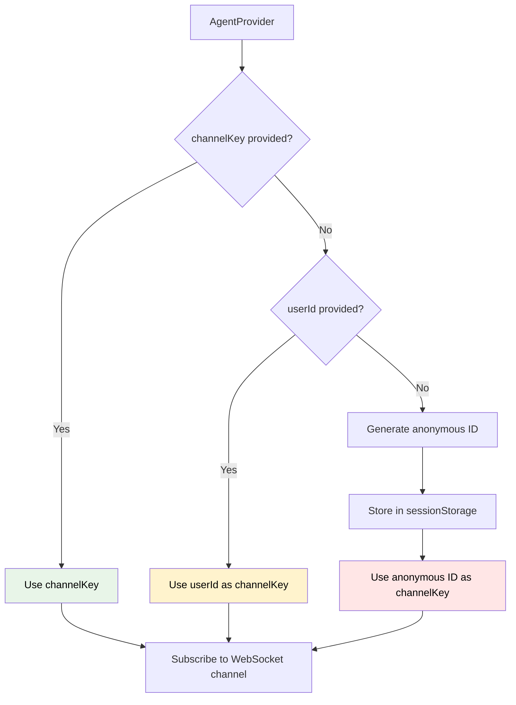

import { Card, CardGroup } from "nextra/components";

The `AgentProvider` is a React context provider that enables **shared WebSocket connections** and **centralized configuration** across your entire AgentKit application. It significantly improves performance and simplifies setup.

<Card title="Performance Impact" icon="zap">
Using AgentProvider can reduce WebSocket connections from N (one per hook) to 1 (shared across all components), improving performance by 3-5x and reducing server load substantially.
</Card>

## Import

```typescript
import { AgentProvider } from "@inngest/use-agents";
```

## Basic Usage

```typescript
import { AgentProvider } from "@inngest/use-agents";

function App() {
  return (
    <AgentProvider userId="user-123" debug={true}>
      <ChatApplication />
    </AgentProvider>
  );
}

function ChatApplication() {
  // Automatically inherits userId and debug from provider
  const { messages, sendMessage } = useChat();
  return <ChatInterface messages={messages} onSend={sendMessage} />;
}
```

## Configuration: `AgentProviderProps`

### User & Channel Configuration

<ParamField path="userId" type="string">
User identifier for attribution and data ownership. If not provided, automatically generates a persistent anonymous ID.

```typescript
// Authenticated user
<AgentProvider userId="user-123">

// Anonymous user (auto-generates persistent ID)
<AgentProvider>  
```
</ParamField>

<ParamField path="channelKey" type="string">
Channel key for subscription targeting. Enables collaborative features when multiple users need to share the same conversation stream.

```typescript
// Private chat (default - uses userId as channelKey)
<AgentProvider userId="user-123">

// Collaborative chat (multiple users share channelKey)
<AgentProvider userId="user-123" channelKey="project-456">
```
</ParamField>

<ParamField path="debug" type="boolean" default="true in development">
Enable comprehensive debug logging for all child hooks and connections.

```typescript
<AgentProvider 
  userId="user-123"
  debug={process.env.NODE_ENV === 'development'}
>
```
</ParamField>

### Transport Configuration

<ParamField path="transport" type="AgentTransport | Partial<DefaultAgentTransportConfig>">
Transport configuration for API calls. Can be either a complete transport instance or configuration object to customize the default transport.

**Configuration Object** (most common):
```typescript
<AgentProvider
  transport={{
    api: {
      sendMessage: '/api/v2/chat',
      fetchThreads: '/api/v2/conversations',
      getRealtimeToken: '/api/v2/realtime/token'
    },
    headers: {
      'Authorization': `Bearer ${getAuthToken()}`,
      'X-API-Version': '2.0'
    },
    baseURL: 'https://api.myapp.com'
  }}
>
```

**Transport Instance** (advanced):
```typescript
import { DefaultAgentTransport } from "@inngest/use-agents";

const customTransport = new DefaultAgentTransport({
  // Custom configuration
});

<AgentProvider transport={customTransport}>
```
</ParamField>

## Channel Resolution Logic

The provider uses intelligent logic to determine which WebSocket channel to subscribe to:



### Channel Key Examples

```typescript
// 1. Explicit channelKey (collaborative scenarios)
<AgentProvider channelKey="project-123" userId="user-456">
// → Subscribes to channel "project-123"
// → Multiple users can share this channel

// 2. UserId fallback (private chat)
<AgentProvider userId="user-789">
// → Subscribes to channel "user-789" 
// → Private chat for this user

// 3. Anonymous fallback (guest users)
<AgentProvider>
// → Generates "anon_a1b2c3d4e5f6"
// → Stores in sessionStorage
// → Persists across page reloads
```

## Configuration Inheritance

### Hierarchy

Child hooks inherit configuration with override capability:

1. **Hook-level options** (highest priority)
2. **Provider options** (inherited when available)  
3. **Default values** (fallback)

```typescript
<AgentProvider 
  userId="user-123" 
  debug={true} 
  transport={globalTransport}
>
  <ComponentA /> {/* Inherits all config */}
  
  <ComponentB userId="user-456" /> {/* Override userId, inherit debug + transport */}
  
  <ComponentC transport={customTransport} /> {/* Override transport, inherit userId + debug */}
</AgentProvider>
```

### Inheritance Examples

```typescript
// Provider configuration
<AgentProvider userId="user-123" debug={true} channelKey="team-chat">
  <ChatComponents />
</AgentProvider>

function ChatComponents() {
  // Full inheritance
  const chat1 = useChat(); 
  // → userId: "user-123", debug: true, channelKey: "team-chat"
  
  // Partial override
  const chat2 = useChat({ userId: "different-user" });
  // → userId: "different-user", debug: true, channelKey: "team-chat"
  
  // Full override
  const chat3 = useChat({ 
    userId: "user-789", 
    channelKey: "private-chat",
    debug: false 
  });
  // → userId: "user-789", debug: false, channelKey: "private-chat"
}
```

## Smart Connection Sharing

### Shared Connection Logic

The provider determines when to share connections based on resolved channel keys:

```typescript
<AgentProvider userId="user-123">  {/* channelKey resolves to "user-123" */}
  <ComponentA />                   {/* channelKey: "user-123" → shared */}
  <ComponentB />                   {/* channelKey: "user-123" → shared */}
  <ComponentC channelKey="admin" />{/* channelKey: "admin" → separate */}
</AgentProvider>
```

**Result**:
- Components A & B share a single WebSocket connection
- Component C gets its own isolated connection for "admin" channel

### Performance Benefits

```typescript
// ❌ Without Provider: Multiple connections
function App() {
  return (
    <div>
      <ThreadSidebar />   {/* useThreads → WebSocket connection 1 */}
      <ChatMessages />    {/* useAgent → WebSocket connection 2 */}
      <ChatInput />       {/* useChat → WebSocket connection 3 */}
      <NotificationArea /> {/* useAgent → WebSocket connection 4 */}
    </div>
  );
}
// Result: 4 WebSocket connections, 4x memory usage

// ✅ With Provider: Shared connection
function App() {
  return (
    <AgentProvider userId="user-123">
      <ThreadSidebar />   {/* Shares connection */}
      <ChatMessages />    {/* Shares connection */}
      <ChatInput />       {/* Shares connection */}
      <NotificationArea /> {/* Shares connection */}
    </AgentProvider>
  );
}
// Result: 1 WebSocket connection, efficient resource usage
```

## Advanced Usage Patterns

### Multi-tenant Applications

```typescript
function TenantApp({ tenantId, userId }) {
  const tenantTransport = useMemo(() => 
    createDefaultAgentTransport({
      headers: {
        'X-Tenant-ID': tenantId,
        'Authorization': `Bearer ${getTenantToken(tenantId)}`
      },
      baseURL: `https://${tenantId}.api.myapp.com`
    }), [tenantId]
  );

  return (
    <AgentProvider 
      userId={userId}
      channelKey={`tenant-${tenantId}-user-${userId}`}
      transport={tenantTransport}
      debug={false}
    >
      <TenantChatInterface />
    </AgentProvider>
  );
}
```

### Environment-based Configuration

```typescript
function EnvironmentAwareProvider({ children }) {
  const config = useMemo(() => {
    if (process.env.NODE_ENV === 'development') {
      return {
        debug: true,
        transport: {
          baseURL: 'http://localhost:3000',
          headers: { 'X-Environment': 'dev' }
        }
      };
    }
    
    if (process.env.NODE_ENV === 'staging') {
      return {
        debug: true,
        transport: {
          baseURL: 'https://staging-api.myapp.com',
          headers: { 'X-Environment': 'staging' }
        }
      };
    }
    
    return {
      debug: false,
      transport: {
        baseURL: 'https://api.myapp.com',
        headers: () => ({
          'Authorization': `Bearer ${getProductionToken()}`,
          'X-Environment': 'production'
        })
      }
    };
  }, []);

  return (
    <AgentProvider {...config}>
      {children}
    </AgentProvider>
  );
}
```

### Authentication Integration

```typescript
function AuthenticatedProvider({ children }) {
  const { user, token, isLoading } = useAuth();
  
  const transport = useMemo(() => 
    createDefaultAgentTransport({
      headers: {
        'Authorization': `Bearer ${token}`,
        'X-User-Role': user?.role || 'guest'
      }
    }), [token, user?.role]
  );

  if (isLoading) return <LoadingSpinner />;
  
  return user ? (
    <AgentProvider 
      userId={user.id}
      transport={transport}
      debug={false}
    >
      {children}
    </AgentProvider>
  ) : (
    <AgentProvider debug={true}>  {/* Anonymous mode */}
      {children}
    </AgentProvider>
  );
}
```

## Provider Utilities

### Optional Access Hooks

Access provider values safely, even outside the provider context:

```typescript
import { 
  useOptionalGlobalUserId,
  useOptionalGlobalTransport,
  useOptionalGlobalAgent,
  useOptionalGlobalChannelKey,
  useOptionalGlobalResolvedChannelKey
} from "@inngest/use-agents";

function FlexibleComponent() {
  const globalUserId = useOptionalGlobalUserId();           // string | null
  const globalTransport = useOptionalGlobalTransport();     // AgentTransport | null
  const globalAgent = useOptionalGlobalAgent();             // UseAgentReturn | null
  const globalChannelKey = useOptionalGlobalChannelKey();   // string | null
  const resolvedChannelKey = useOptionalGlobalResolvedChannelKey(); // string | null

  // Handle both provider and non-provider scenarios
  const effectiveUserId = globalUserId || "fallback-user";
  const effectiveTransport = globalTransport || createDefaultAgentTransport();
  
  return <div>Works with or without provider!</div>;
}
```

### Strict Access Hooks

For components that require provider context:

```typescript
import { 
  useGlobalAgentStrict,
  useGlobalTransportStrict,
  useGlobalUserId,
  useGlobalChannelKey
} from "@inngest/use-agents";

function ProviderRequiredComponent() {
  const agent = useGlobalAgentStrict();     // Throws if no provider
  const transport = useGlobalTransportStrict(); // Throws if no provider
  const userId = useGlobalUserId();         // Returns null if no provider
  const channelKey = useGlobalChannelKey(); // Returns null if no provider

  // These components fail fast if used outside AgentProvider
}
```

## Debugging & Troubleshooting

### Debug Output

Enable debug mode to see provider activity:

```typescript
<AgentProvider userId="user-123" debug={true}>

// Console output:
// 🔍 [AgentProvider] Creating agent connection for channelKey: user-123
// ✅ [AgentProvider] Channel subscription token created
// 🔧 [useChat] Inheriting userId from provider: user-123
// 🔄 [useAgent] Using shared connection for channel: user-123
```
</ParamField>

### Connection Diagnostics

```typescript
function ConnectionDiagnostics() {
  const globalAgent = useOptionalGlobalAgent();
  const resolvedChannelKey = useOptionalGlobalResolvedChannelKey();
  
  useEffect(() => {
    console.log('Provider Diagnostics:', {
      hasProvider: !!globalAgent,
      channelKey: resolvedChannelKey,
      isConnected: globalAgent?.isConnected,
      activeThreads: globalAgent ? Object.keys(globalAgent.threads).length : 0
    });
  }, [globalAgent, resolvedChannelKey]);
  
  return (
    <div>
      {globalAgent ? (
        <div>✅ Provider connection active for {resolvedChannelKey}</div>
      ) : (
        <div>❌ No provider - components using individual connections</div>
      )}
    </div>
  );
}
```

### Common Issues

**"Multiple connections created"**
- Check for channelKey mismatches between provider and hooks
- Ensure transport configuration is stable (use `useMemo`)
- Verify provider is properly wrapping all components

```typescript
// ❌ Causes multiple connections
<AgentProvider channelKey="shared">
  <ComponentA channelKey="different" />  {/* Separate connection! */}
</AgentProvider>

// ✅ Shared connection
<AgentProvider channelKey="shared">
  <ComponentA />  {/* Inherits channelKey → shared connection */}
</AgentProvider>
```

**"Configuration not inherited"**
- Verify hooks are called within provider children
- Check for TypeScript errors in configuration
- Enable debug mode to trace inheritance

**"Transport not working"**
- Ensure transport configuration is stable across renders
- Check for authentication/network issues
- Verify API endpoints are correct

## Real-world Examples

### E-commerce Customer Support

```typescript
function CustomerSupportApp({ customerId }) {
  const supportTransport = useMemo(() => 
    createDefaultAgentTransport({
      api: {
        sendMessage: '/api/support/chat',
        fetchThreads: '/api/support/threads',
        approveToolCall: '/api/support/approve-action'
      },
      headers: {
        'X-Customer-ID': customerId,
        'X-Support-Context': 'customer-portal',
        'Authorization': `Bearer ${getCustomerToken()}`
      }
    }), [customerId]
  );

  return (
    <AgentProvider 
      userId={customerId}
      transport={supportTransport}
      debug={false} // Production mode
    >
      <SupportChatInterface />
      <SupportSidebar />
      <SupportTicketActions />
    </AgentProvider>
  );
}
```

### Team Collaboration Platform

```typescript
function TeamWorkspace({ teamId, currentUserId }) {
  return (
    <AgentProvider 
      channelKey={`team-${teamId}`}  // All team members share this channel
      userId={currentUserId}         // Individual user attribution
      transport={{
        headers: {
          'X-Team-ID': teamId,
          'X-User-Role': getUserRole(currentUserId, teamId)
        }
      }}
    >
      <TeamChatInterface />      {/* Shared team conversations */}
      <PersonalAssistant />      {/* Personal AI assistant */}
      <ProjectDiscussions />     {/* Project-specific chats */}
    </AgentProvider>
  );
}

// All components receive events from the same team channel
// but can create isolated threads for different discussions
```

### Development vs Production

```typescript
function EnvironmentProvider({ children }) {
  const isDev = process.env.NODE_ENV === 'development';
  
  const config = useMemo(() => ({
    debug: isDev,
    transport: {
      baseURL: isDev 
        ? 'http://localhost:3000' 
        : 'https://api.myapp.com',
      headers: isDev 
        ? { 'X-Environment': 'development' }
        : () => ({
            'Authorization': `Bearer ${getProductionToken()}`,
            'X-Environment': 'production'
          })
    }
  }), [isDev]);

  return (
    <AgentProvider {...config}>
      {children}
    </AgentProvider>
  );
}
```

## Performance Optimization

### Stable Configuration

```typescript
function OptimizedApp() {
  // ✅ Stable transport configuration
  const transport = useMemo(() => 
    createDefaultAgentTransport({
      headers: { 'Authorization': `Bearer ${token}` }
    }), [token] // Only recreate when token changes
  );

  return (
    <AgentProvider transport={transport}>
      <ChatApp />
    </AgentProvider>
  );
}

// ❌ Recreated on every render
function UnoptimizedApp() {
  return (
    <AgentProvider 
      transport={createDefaultAgentTransport({  // New instance every render!
        headers: { 'Authorization': `Bearer ${token}` }
      })}
    >
      <ChatApp />
    </AgentProvider>
  );
}
```

### Connection Lifecycle

The provider manages connection lifecycle efficiently:

```typescript
// Provider creates connection on mount
useEffect(() => {
  const connection = establishConnection(resolvedChannelKey);
  
  return () => {
    connection.cleanup(); // Automatic cleanup on unmount
  };
}, [resolvedChannelKey]); // Only recreate if channel changes

// Child components automatically share this connection
```

### Memory Management

```typescript
function MemoryEfficientProvider({ children }) {
  // ✅ Stable anonymous ID generation
  const [anonymousId] = useState(() => {
    if (typeof window !== 'undefined') {
      let id = sessionStorage.getItem("agentkit-anonymous-id");
      if (!id) {
        id = `anon_${uuidv4()}`;
        sessionStorage.setItem("agentkit-anonymous-id", id);
      }
      return id;
    }
    return `anon_${uuidv4()}`;
  });

  return (
    <AgentProvider userId={anonymousId}>
      {children}
    </AgentProvider>
  );
}
```

## Multi-Provider Scenarios

### Nested Providers

Handle complex applications with multiple user contexts:

```typescript
function MultiContextApp() {
  return (
    <AgentProvider userId="user-123">
      {/* Main user context */}
      <UserDashboard />
      
      {/* Nested admin context */}
      <AgentProvider userId="admin-456" channelKey="admin-panel">
        <AdminInterface />     {/* Uses admin context */}
      </AgentProvider>
      
      {/* Guest support context */}
      <AgentProvider>  {/* Anonymous user */}
        <GuestSupport />       {/* Uses anonymous context */}
      </AgentProvider>
    </AgentProvider>
  );
}
```

### Provider Isolation

Control connection isolation for security or performance:

```typescript
function IsolatedFeatures() {
  return (
    <div>
      {/* Main application */}
      <AgentProvider userId="user-123">
        <MainChatApp />
      </AgentProvider>
      
      {/* Isolated admin panel */}
      <AgentProvider 
        userId="user-123" 
        channelKey="admin-secure"  // Separate channel for security
        transport={adminSecureTransport}
      >
        <AdminPanel />
      </AgentProvider>
      
      {/* Isolated demo area */}
      <AgentProvider>  {/* Anonymous session */}
        <DemoPlayground />
      </AgentProvider>
    </div>
  );
}
```

## Testing Strategies

### Provider Mocking

```typescript
// Mock provider for testing
function MockAgentProvider({ children, mockAgent }) {
  const mockContext = {
    agent: mockAgent,
    transport: mockTransport,
    userId: "test-user",
    channelKey: "test-channel",
    resolvedChannelKey: "test-channel"
  };

  return (
    <AgentContext.Provider value={mockContext}>
      {children}
    </AgentContext.Provider>
  );
}

// Test component
test('chat component with mock provider', () => {
  const mockAgent = {
    messages: [],
    sendMessage: jest.fn(),
    status: 'idle',
    isConnected: true
  };

  render(
    <MockAgentProvider mockAgent={mockAgent}>
      <ChatComponent />
    </MockAgentProvider>
  );
});
```

### Integration Testing

```typescript
function TestWrapper({ children, config = {} }) {
  const defaultConfig = {
    userId: "test-user-123",
    debug: true,
    transport: createTestTransport()
  };

  return (
    <AgentProvider {...defaultConfig} {...config}>
      {children}
    </AgentProvider>
  );
}

// Use in tests
describe('Chat Integration', () => {
  test('sends message successfully', async () => {
    render(
      <TestWrapper>
        <ChatComponent />
      </TestWrapper>
    );
    
    // Test interactions...
  });
});
```

## Security Considerations

### Token Management

```typescript
function SecureProvider({ children }) {
  const [token, setToken] = useState<string | null>(null);
  
  const transport = useMemo(() => {
    if (!token) return undefined;
    
    return createDefaultAgentTransport({
      headers: () => ({
        'Authorization': `Bearer ${token}`,
        'X-Timestamp': Date.now().toString(),
        'X-Request-ID': generateRequestId()
      })
    });
  }, [token]);

  // Handle token refresh
  useEffect(() => {
    const refreshToken = async () => {
      try {
        const newToken = await getValidToken();
        setToken(newToken);
      } catch (error) {
        console.error('Token refresh failed:', error);
        // Handle auth failure
      }
    };

    refreshToken();
    const interval = setInterval(refreshToken, 15 * 60 * 1000); // Refresh every 15min
    return () => clearInterval(interval);
  }, []);

  if (!token || !transport) {
    return <AuthenticationRequired />;
  }

  return (
    <AgentProvider transport={transport}>
      {children}
    </AgentProvider>
  );
}
```

### Channel Security

```typescript
// Ensure channel keys are properly scoped for security
function SecureChannelProvider({ userId, tenantId, children }) {
  // Include tenant context in channel key to prevent cross-tenant access
  const secureChannelKey = `tenant-${tenantId}-user-${userId}`;
  
  return (
    <AgentProvider 
      userId={userId}
      channelKey={secureChannelKey}
      transport={{
        headers: {
          'X-Tenant-ID': tenantId,
          'X-Security-Context': 'verified'
        }
      }}
    >
      {children}
    </AgentProvider>
  );
}
```

## Best Practices

### ✅ Do

- **Wrap early in component tree** (layout.tsx or _app.tsx)
- **Use stable configuration** objects with `useMemo`
- **Enable debug mode** during development
- **Leverage inheritance** to reduce configuration duplication
- **Plan channel keys** for proper connection isolation
- **Handle authentication** gracefully with token refresh

### ❌ Don't

- **Nest providers unnecessarily** - one provider usually sufficient
- **Recreate transport** configuration on every render
- **Hardcode sensitive values** - use environment variables
- **Ignore connection sharing** - it significantly improves performance
- **Mix channelKeys carelessly** - understand security implications

### Performance Tips

```typescript
// ✅ Efficient patterns
const stableConfig = useMemo(() => ({
  transport: createDefaultAgentTransport(config)
}), [configDependencies]);

<AgentProvider {...stableConfig}>

// ✅ Proper dependency management
const transport = useMemo(() => 
  createDefaultAgentTransport({ headers: { token } }), 
  [token] // Only recreate when token changes
);

// ✅ Early provider placement
<html>
  <body>
    <AgentProvider userId={user.id}>  {/* Wrap entire app */}
      <AppRouter />
    </AgentProvider>
  </body>
</html>
```

## Next Steps

<CardGroup>
  <Card
    title="useChat Reference"
    href="/reference/react-hooks/use-chat"
  >
    Recommended hook that builds on AgentProvider for complete chat apps
  </Card>
  <Card
    title="Transport Reference"
    href="/reference/react-hooks/transport"
  >
    Complete transport configuration and customization guide
  </Card>
  <Card
    title="Provider Pattern Guide"
    href="/streaming/provider-pattern"
  >
    Best practices and optimization strategies for AgentProvider
  </Card>
  <Card
    title="Performance Optimization"
    href="/advanced-patterns/production-deployment"
  >
    Scale AgentKit applications for production workloads
  </Card>
</CardGroup>

AgentProvider is the foundation that makes AgentKit's React hooks both powerful and efficient. By centralizing configuration and enabling connection sharing, it transforms individual hooks into a cohesive, high-performance system for building production-scale AI applications.
