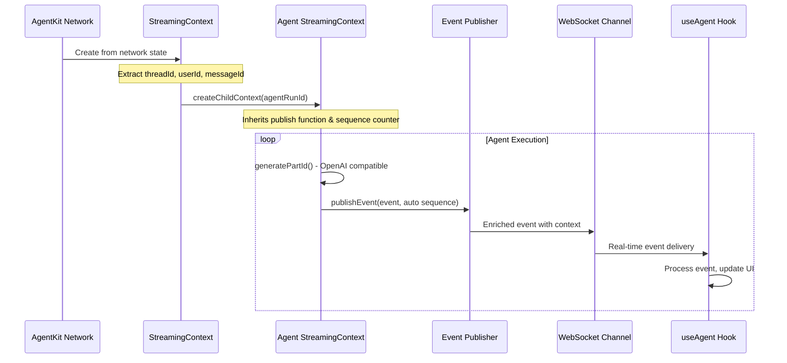

import { Card, CardGroup } from "nextra/components";

AgentKit's **automatic streaming system** is a sophisticated event publishing infrastructure that captures every aspect of agent execution and delivers it to your UI in real-time. This system is the secret behind AgentKit's responsive chat interfaces.

## The StreamingContext System

At the heart of automatic streaming is the **StreamingContext** - a hierarchical context management system that automatically captures, enriches, and publishes events from your AgentKit networks.

### Key Innovations

🔄 **Hierarchical Contexts**: Network runs create child agent contexts seamlessly
⚡ **Shared Sequence Counters**: Perfect event ordering across multiple contexts  
🎯 **Automatic Enrichment**: Events auto-enriched with threadId, userId, metadata
🛡️ **Best-effort Publishing**: Graceful error handling that never breaks execution
🔧 **Transparent Integration**: Works with existing code via Proxy-based step wrapper
📏 **OpenAI Compliance**: Tool call IDs generated within 40-character limit

## Architecture Deep Dive

### StreamingContext Lifecycle



### Sequence Management

The system maintains perfect event ordering through **shared sequence counters**:

```typescript
class SequenceCounter {
  private value: number = 0;

  getNext(): number {
    return this.value++;
  }
}

// Network context creates counter
const networkContext = new StreamingContext({ sequenceCounter });

// Agent contexts share the same counter
const agentContext = networkContext.createChildContext(agentRunId);
// Events: network=0,1,2 → agent=3,4,5 → network=6,7...
```

**Result**: Events arrive at your React hook in perfect chronological order, preventing UI glitches and ensuring smooth streaming.

## Event Schema & Types

### 🚀 Lifecycle Events

Track the complete execution flow:

```typescript
// Agent starts executing
{
  event: "run.started",
  data: {
    runId: "run_123",
    scope: "agent", 
    name: "CustomerSupportAgent",
    messageId: "msg_456",
    threadId: "thread_789", // Auto-enriched
    userId: "user_123"      // Auto-enriched
  },
  sequenceNumber: 0,
  timestamp: 1703123456789
}

// Agent completes with usage stats
{
  event: "run.completed", 
  data: {
    runId: "run_123",
    scope: "agent",
    result: { success: true },
    usage: {
      promptTokens: 150,
      completionTokens: 75, 
      totalTokens: 225
    }
  },
  sequenceNumber: 15,
  timestamp: 1703123467890
}
```

### 📝 Content Streaming Events

Stream text and reasoning content incrementally:

```typescript
// New text part created
{
  event: "part.created",
  data: {
    partId: "text_msg456_12345_abc123", // Auto-generated
    messageId: "msg_456",
    type: "text",
    metadata: { agentName: "CustomerSupport" }
  },
  sequenceNumber: 3
}

// Text content streamed character by character
{
  event: "text.delta",
  data: {
    partId: "text_msg456_12345_abc123",
    messageId: "msg_456", 
    delta: "I'll help you with your refund request. Let me"
  },
  sequenceNumber: 4
}

// Agent reasoning (optional transparency)
{
  event: "reasoning.delta",
  data: {
    partId: "reasoning_msg456_67890_def456",
    messageId: "msg_456",
    delta: "The user is asking for a refund. I should check our policy..."
  },
  sequenceNumber: 5
}
```

### 🛠️ Tool Execution Events

Stream tool calls with input and output:

```typescript
// Tool call initiated
{
  event: "part.created",
  data: {
    partId: "tool_msg456_11111_xyz789", 
    messageId: "msg_456",
    type: "tool-call",
    metadata: { toolName: "lookup_customer_orders" }
  },
  sequenceNumber: 6
}

// Tool arguments streamed
{
  event: "tool_call.arguments.delta",
  data: {
    partId: "tool_msg456_11111_xyz789",
    messageId: "msg_456",
    delta: '{"customerId": "cust_123", "status":'
  },
  sequenceNumber: 7
}

// Tool output streamed back  
{
  event: "tool_call.output.delta",
  data: {
    partId: "tool_msg456_11111_xyz789",
    messageId: "msg_456", 
    delta: "Found 3 recent orders for customer..."
  },
  sequenceNumber: 9
}
```

### 🤝 Human-in-the-Loop Events

Handle approval workflows seamlessly:

```typescript
// Approval requested
{
  event: "hitl.requested",
  data: {
    requestId: "hitl_123",
    toolCalls: [{ 
      toolName: "process_refund", 
      toolInput: { amount: 99.99, orderId: "ord_456" }
    }],
    expiresAt: "2024-01-01T12:00:00Z",
    metadata: { riskLevel: "high", reason: "Large refund amount" }
  },
  sequenceNumber: 10
}

// User approval decision
{
  event: "hitl.resolved", 
  data: {
    requestId: "hitl_123",
    resolution: "approved",
    reason: "Valid refund request verified",
    resolvedBy: "user_123",
    resolvedAt: "2024-01-01T11:55:00Z"
  },
  sequenceNumber: 11
}
```

## Automatic Event Enrichment

The StreamingContext automatically enriches all events with essential context:

### Context Extraction

```typescript
// StreamingContext extracts context from network state
const context = StreamingContext.fromNetworkState(networkState, {
  publish: async (chunk) => { /* ... */ },
  runId: generateId(),
  messageId: userMessage.id,
  scope: "network"
});

// Context contains:
// - threadId: from network state
// - userId: from network state  
// - messageId: from user message
// - runId: unique run identifier
```

### Automatic Enrichment

```typescript
// Before enrichment (internal)
const rawEvent = {
  event: "text.delta",
  data: { partId: "text_123", delta: "Hello" }
};

// After enrichment (published)
const enrichedEvent = {
  event: "text.delta", 
  data: { 
    partId: "text_123", 
    delta: "Hello",
    threadId: "thread_789",  // Auto-added
    userId: "user_123",      // Auto-added
    messageId: "msg_456"     // Auto-added
  },
  sequenceNumber: 4,         // Auto-generated
  timestamp: 1703123456789,  // Auto-generated
  id: "publish-4:text.delta" // Auto-generated
};
```

## Parent/Child Context Inheritance

When a network calls agents, contexts inherit seamlessly:

```typescript
// Network creates main context
const networkContext = new StreamingContext({
  scope: "network",
  runId: "network_run_123", 
  messageId: "msg_456",
  // ... other config
});

// Agent gets child context automatically
const agentContext = networkContext.createChildContext("agent_run_456");
// Child inherits:
// - Same publish function
// - Same sequence counter (for perfect ordering)
// - Same threadId, userId, messageId
// - Parent runId becomes parentRunId
```

**Result**: Events from network orchestration and individual agents arrive in perfect chronological order at your React hook.

## Transparent Integration

The streaming system integrates transparently with your existing AgentKit code:

### Proxy-based Step Wrapper

```typescript
// Your existing Inngest function - no changes needed!
export const runAgentChat = inngest.createFunction(
  { id: "run-agent-chat" },
  { event: "agent/chat.requested" },
  async ({ event, step, publish }) => {
    // StreamingContext wraps your step tools transparently
    const wrappedStep = createStepWrapper(step, streamingContext);
    
    // Your network code works unchanged
    const result = await network.run(message, {
      streaming: {
        publish: async (chunk) => {
          // Events automatically enriched and published
          await publish(userChannel(userId).agent_stream(chunk));
        },
      },
    });
  }
);
```

### Zero-Config Agent Integration

```typescript
// Your agents work unchanged - streaming happens automatically
const customerAgent = createAgent({
  name: "Customer Support Agent",
  model: openai({ model: "gpt-4o" }),
  tools: [refundTool, lookupTool], // Tools automatically stream
  // No streaming configuration needed!
});
```

## Error Handling & Resilience

### Best-effort Publishing

Streaming never breaks your agent execution:

```typescript
async publishEvent(event) {
  try {
    await this.publish(chunk);
  } catch (err) {
    // Swallow publishing errors - continue execution
    console.warn("[Streaming] Failed to publish event; continuing execution", {
      error: err.message,
      event: chunk.event,
      sequenceNumber: chunk.sequenceNumber
    });
  }
}
```

### Connection Recovery

The React hooks handle connection failures gracefully:
- **Automatic Reconnection**: WebSocket reconnects on network issues
- **Event Buffering**: Out-of-order events are buffered and reordered
- **State Recovery**: UI state preserved across connection interruptions
- **Error Boundaries**: Rich error objects with recovery guidance

## Performance Optimizations

### Shared Sequence Counters

Instead of separate counters per context:

```typescript
// ❌ Separate counters - events can overlap
networkCounter: 0,1,2,3...
agentCounter:   0,1,2,3...  // Same numbers!

// ✅ Shared counter - perfect ordering
sharedCounter: 0,1,2,3,4,5,6,7,8,9...
//             │ │ │ │ │ │ │ │ │ └─ agent
//             │ │ │ │ │ │ │ │ └─── network  
//             │ │ │ │ │ │ │ └───── agent
//             └─┴─┴─┴─┴─┴─┴─────── network
```

### Connection Sharing

The AgentProvider enables efficient connection sharing:

```typescript
// ✅ Single WebSocket connection shared across components
<AgentProvider userId="user-123">
  <ChatSidebar />      {/* Shares connection */}
  <ChatMessages />     {/* Shares connection */}  
  <ChatInput />        {/* Shares connection */}
</AgentProvider>
```

## OpenAI Compatibility

Tool call IDs are automatically generated within OpenAI's constraints:

```typescript
generatePartId(): string {
  // Format: "tool_" + shortMessageId + "_" + timestamp + "_" + random
  // Example: "tool_1a2b3c4d_12345678_ab9f2x" (29 chars < 40 limit)
  const shortMessageId = this.messageId.replace(/-/g, '').substring(0, 8);
  const shortTimestamp = Date.now().toString().slice(-8);
  const randomSuffix = Math.random().toString(36).substr(2, 6);
  return `tool_${shortMessageId}_${shortTimestamp}_${randomSuffix}`;
}
```

## Debug Visibility

Comprehensive logging for development:

```typescript
// StreamingContext creation
console.log('🔧 [STREAMING-CTX] Creating StreamingContext:', {
  runId: 'network_run_123',
  messageId: 'msg_456', 
  scope: 'network',
  threadId: 'thread_789'
});

// Event publishing
console.log('🔧 [PUBLISH] Publishing event:', {
  event: 'text.delta',
  sequenceNumber: 4,
  partId: 'text_msg456_12345_abc123'
});

// Child context creation  
console.log('🔧 [CHILD-CTX] Creating child context:', {
  parentRunId: 'network_run_123',
  childRunId: 'agent_run_456',
  inheritedSequenceCounter: true
});
```

## Integration Examples

### Basic Network Streaming

```typescript
// Create network with automatic streaming
const network = createNetwork({
  agents: [customerAgent, billingAgent],
  defaultModel: openai({ model: "gpt-4o" }),
});

// Run with streaming - context created automatically
const result = await network.run(message, {
  streaming: {
    publish: async (chunk) => {
      // Events automatically enriched by StreamingContext
      await publish(userChannel(userId).agent_stream(chunk));
    },
  },
  messageId: userMessage.id, // Used for context creation
});
```

### Custom Context Configuration

```typescript
// Manual context creation for advanced scenarios
const customContext = new StreamingContext({
  publish: myCustomPublisher,
  runId: generateId(),
  messageId: userMessage.id,
  threadId: conversation.id,
  userId: user.id,
  scope: "network",
  debug: true // Enable detailed logging
});

// Use with network
const result = await network.run(message, {
  streaming: {
    publish: (chunk) => customContext.publishEvent(chunk),
  },
});
```

## Event Flow Example

Here's how a typical agent interaction generates streaming events:

```typescript
// User sends: "I need a refund for order #123"

// 1. Network starts
{ event: "run.started", data: { scope: "network", name: "CustomerSupport" }, seq: 0 }

// 2. Agent starts  
{ event: "run.started", data: { scope: "agent", name: "RefundAgent" }, seq: 1 }

// 3. Text part created
{ event: "part.created", data: { type: "text", partId: "text_abc123" }, seq: 2 }

// 4. Reasoning streamed
{ event: "reasoning.delta", data: { delta: "User wants refund..." }, seq: 3 }

// 5. Text response streamed
{ event: "text.delta", data: { delta: "I'll help you with" }, seq: 4 }
{ event: "text.delta", data: { delta: " your refund request." }, seq: 5 }

// 6. Tool call created
{ event: "part.created", data: { type: "tool-call", toolName: "lookup_order" }, seq: 6 }

// 7. Tool arguments streamed  
{ event: "tool_call.arguments.delta", data: { delta: '{"orderId":"123"}' }, seq: 7 }

// 8. Tool execution
{ event: "part.completed", data: { type: "tool-call" }, seq: 8 }
{ event: "tool_call.output.delta", data: { delta: "Order found..." }, seq: 9 }

// 9. Final response
{ event: "text.delta", data: { delta: " Your order is eligible" }, seq: 10 }
{ event: "part.completed", data: { type: "text", finalContent: "..." }, seq: 11 }

// 10. Agent completes
{ event: "run.completed", data: { scope: "agent" }, seq: 12 }
```

**Result**: Your React hook receives these events in perfect order and updates the UI incrementally, showing reasoning, tool calls, and final response as they happen.

## Advanced Features

### Context Metadata

Events can include rich metadata for enhanced UI:

```typescript
await context.publishEvent({
  event: "part.created",
  data: {
    partId: generatePartId(),
    type: "tool-call",
    metadata: {
      toolName: "process_refund",
      estimatedDuration: "30s",
      riskLevel: "high",
      requiresApproval: true
    }
  }
});
```

### Custom Event Types

Extend the system with application-specific events:

```typescript
// Custom business logic events
await context.publishEvent({
  event: "business.escalation_triggered", 
  data: {
    escalationReason: "refund_amount_exceeds_limit",
    escalatedTo: "senior_support_agent",
    escalationId: generateId()
  }
});
```

### Multi-Agent Coordination

Handle complex multi-agent workflows:

```typescript
// Network orchestrates multiple agents
const networkContext = StreamingContext.fromNetworkState(state, config);

// Each agent gets isolated child context
const classifierContext = networkContext.createChildContext("classifier_run");
const resolverContext = networkContext.createChildContext("resolver_run");
const escalationContext = networkContext.createChildContext("escalation_run");

// All events maintain chronological order across agents
// seq: 0,1,2 (network) → 3,4,5 (classifier) → 6,7,8 (resolver) → 9,10,11 (escalation)
```

## Next Steps

<CardGroup>
  <Card
    title="React Hooks Quickstart"
    href="/streaming/react-hooks-quickstart"
  >
    Learn how to consume these events with our React hooks
  </Card>
  <Card
    title="useAgent API Reference" 
    href="/reference/react-hooks/use-agent"
  >
    Complete API documentation for the useAgent hook
  </Card>
  <Card
    title="Custom Transport Configuration"
    href="/streaming/transport-configuration"
  >
    Customize API endpoints and authentication
  </Card>
  <Card
    title="Production Deployment"
    href="/advanced-patterns/production-deployment"
  >
    Scale streaming for production workloads
  </Card>
</CardGroup>

## Summary

AgentKit's automatic streaming system is a game-changing innovation that:

- **Eliminates Setup**: Zero configuration required for sophisticated streaming
- **Ensures Consistency**: Perfect event ordering across complex agent workflows
- **Provides Transparency**: Complete visibility into agent reasoning and tool usage
- **Enables Rich UIs**: Real-time updates for responsive, engaging chat interfaces
- **Maintains Reliability**: Best-effort publishing that never disrupts agent execution

This foundation enables the powerful React hooks in `@inngest/use-agents` to provide seamless real-time chat experiences that rival the best AI applications.
