The `@inngest/use-agents` package provides multiple React hooks for different use cases. This guide helps you choose the right hook and understand when to combine them for maximum effectiveness.

## Hook Overview

| Hook                       | Purpose                  | Best For                             | Complexity      |
| -------------------------- | ------------------------ | ------------------------------------ | --------------- |
| `useChat`                  | **Complete chat apps**   | Full-featured chat interfaces        | **Recommended** |
| `useAgent`                 | **Low-level streaming**  | Custom implementations, fine control | Advanced        |
| `useThreads`               | **Thread management**    | Custom sidebar, thread lists         | Intermediate    |
| `useEphemeralThreads`      | **Demo/offline storage** | Prototypes, guest users              | Simple          |
| `useConversationBranching` | **Message editing**      | Advanced editing workflows           | Advanced        |

## 🎯 useChat (Recommended for Most Apps)

**Perfect for**: Complete chat applications with threads, real-time streaming, and persistence.

**What you get**:

- ✅ Real-time message streaming
- ✅ Thread management and persistence
- ✅ History loading and caching
- ✅ Optimistic updates
- ✅ Error handling and recovery
- ✅ HITL (Human-in-the-Loop) support

**Use when**:

- Building a chat application from scratch
- Need both real-time streaming AND thread management
- Want maximum functionality with minimal setup
- Building URL-driven chat pages (`/chat/[threadId]`)

```typescript
// Perfect for: Complete chat applications
const {
  messages,
  sendMessage,
  status, // Real-time streaming
  threads,
  switchToThread, // Thread management
  createNewThread,
  deleteThread, // Thread operations
} = useChat({
  initialThreadId: params.threadId, // URL-driven
  state: () => ({ currentPage: "/chat" }), // Client state capture
});
```

**Examples**:

- Customer support chat apps
- Documentation Q&A interfaces
- AI assistants with conversation history
- Multi-user collaborative chat

---

## ⚡ useAgent (Advanced/Custom Implementations)

**Perfect for**: When you need direct control over the streaming events and multi-thread state.

**What you get**:

- ✅ Raw streaming event access
- ✅ Multi-thread management
- ✅ Out-of-order event handling
- ✅ Connection state management
- ❌ No automatic thread persistence
- ❌ No automatic history loading

**Use when**:

- Building custom chat UIs with specific requirements
- Need access to raw streaming events for advanced processing
- Implementing non-standard message flows
- Building embedded chat components with custom persistence

```typescript
// Perfect for: Custom implementations with fine control
const {
  messages,
  sendMessage,
  status,
  threads,
  setCurrentThread, // Manual thread switching
  isConnected,
  connectionError, // Connection management
  sendMessageToThread, // Multi-thread messaging
  replaceMessages, // Custom history loading
} = useAgent({
  threadId: "conversation-123",
  userId: "user-456",
  debug: true,
  state: () => ({ customContext: true }),
});
```

**Examples**:

- Custom chat widgets with unique UI requirements
- Embedded chat in larger applications
- Multi-agent systems with complex routing
- Research/experimental interfaces

---

## 📋 useThreads (Thread Management Only)

**Perfect for**: Building custom thread management without real-time streaming.

**What you get**:

- ✅ Thread listing and pagination
- ✅ CRUD operations (create, delete, rename)
- ✅ Caching and optimistic updates
- ✅ Background refresh and sync
- ❌ No real-time message streaming
- ❌ No connection management

**Use when**:

- Building custom sidebar components
- Need thread management without streaming
- Implementing non-chat thread interfaces
- Building thread analytics or management tools

```typescript
// Perfect for: Custom thread management interfaces
const {
  threads,
  loading,
  hasMore,
  createThread,
  deleteThread,
  loadMore,
  refresh,
  currentThreadId,
  setCurrentThreadId,
} = useThreads({
  userId: "user-123",
});
```

**Examples**:

- Custom sidebar components
- Thread management dashboards
- Conversation analytics interfaces
- Archive/search interfaces

---

## 💾 useEphemeralThreads (Demo/Offline Storage)

**Perfect for**: Demos, prototypes, and offline scenarios without backend persistence.

**What you get**:

- ✅ Client-side thread storage (localStorage/sessionStorage)
- ✅ Compatible with useChat/useAgent
- ✅ Zero backend requirements
- ✅ Perfect for prototyping
- ❌ No cross-device synchronization
- ❌ Data lost on storage clear

**Use when**:

- Building demos or proof-of-concepts
- Guest user scenarios without account creation
- Offline-capable applications
- Development/testing without backend setup

```typescript
// Perfect for: Demos and prototypes
const ephemeralThreads = useEphemeralThreads({
  userId: "guest-user",
  storageType: "session", // or 'local'
});

const chat = useChat({
  userId: "guest-user",
  enableThreadValidation: false, // No backend validation
  ...ephemeralThreads, // Drop-in replacement
});
```

**Examples**:

- Product demos and showcases
- Guest chat experiences
- Educational tutorials
- Development playgrounds (like our SQL Playground)

---

## 🌿 useConversationBranching (Advanced Editing)

**Perfect for**: Implementing message editing with alternate conversation paths.

**What you get**:

- ✅ Message editing workflows
- ✅ Conversation branching (like ChatGPT edit feature)
- ✅ History preservation and navigation
- ✅ Client state rehydration
- ❌ Complex setup required
- ❌ Additional storage needs

**Use when**:

- Building ChatGPT-like edit functionality
- Need conversation exploration features
- Implementing A/B testing for agent responses
- Building research/experimental chat tools

```typescript
// Perfect for: Advanced message editing workflows
const branching = useConversationBranching({
  userId: "user-123",
  storageType: "session",
});

// Wrap sendMessage to support branching
const sendMessage = useCallback(
  async (message, options) => {
    await branching.sendMessage(
      originalSendMessage,
      sendMessageToThread,
      replaceMessages,
      threadId,
      message,
      messages,
      options
    );
  },
  [
    /* deps */
  ]
);
```

**Examples**:

- Research interfaces for conversation exploration
- A/B testing different agent responses
- Educational tools for learning conversation patterns
- Advanced chat applications with editing features

## 🔧 Utility Hooks

### useMessageActions

```typescript
const { copyMessage, likeMessage, shareMessage, readAloud } = useMessageActions(
  {
    showToast: (message, type) => toast[type](message),
    onCopy: (text) => analytics.track("message_copied"),
  }
);
```

### useEditMessage

```typescript
const {
  editingMessage,
  editValue,
  setEditValue,
  handleEditMessage,
  handleSaveEdit,
  handleCancelEdit,
} = useEditMessage({
  sendMessage: (content) => sendMessage(content),
});
```

### useSidebar

```typescript
const {
  sidebarMinimized,
  setSidebarMinimized,
  mobileSidebarOpen,
  setMobileSidebarOpen,
  toggleSidebar,
} = useSidebar();
```

### useIsMobile

```typescript
const isMobile = useIsMobile(); // boolean - updates on resize
```

## Hook Combination Patterns

### Pattern 1: Complete Chat App (Recommended)

```typescript
// Single hook for everything
function ChatApp() {
  const chat = useChat({
    initialThreadId: params.threadId
  });

  return <ChatInterface {...chat} />;
}
```

**Benefits**: Simplest setup, handles everything automatically
**Drawbacks**: Less customization control

### Pattern 2: Separate Concerns

```typescript
// Separate hooks for custom control
function ChatApp() {
  const agent = useAgent({ threadId });
  const threads = useThreads({ userId });
  const messageActions = useMessageActions();

  // Custom coordination logic
  useEffect(() => {
    if (threads.currentThreadId !== agent.currentThreadId) {
      agent.setCurrentThread(threads.currentThreadId);
    }
  }, [threads.currentThreadId, agent.currentThreadId]);

  return <CustomChatInterface {...agent} {...threads} {...messageActions} />;
}
```

**Benefits**: Maximum control and customization
**Drawbacks**: More complex setup and coordination

### Pattern 3: Provider + Multiple Components

```typescript
// Shared provider with specialized components
function App() {
  return (
    <AgentProvider userId="user-123">
      <ChatSidebar />   {/* Uses useThreads */}
      <ChatMessages />  {/* Uses useAgent */}
      <ChatInput />     {/* Uses useChat functions */}
    </AgentProvider>
  );
}
```

**Benefits**: Component separation, shared connections
**Drawbacks**: Requires coordination between components

## Decision Tree

```mermaid
flowchart TD
    A[What are you building?] --> B{Complete chat app?}
    B -->|Yes| C{Need custom persistence?}
    C -->|No| D[useChat 🎯]
    C -->|Yes| E[useChat + custom transport]

    B -->|No| F{Just thread management?}
    F -->|Yes| G{Real backend?}
    G -->|Yes| H[useThreads]
    G -->|No| I[useEphemeralThreads]

    F -->|No| J{Custom streaming control?}
    J -->|Yes| K[useAgent]
    J -->|No| L{Message editing?}
    L -->|Yes| M[useConversationBranching]
    L -->|No| N[Utility hooks]

    style D fill:#e8f5e8
    style E fill:#e8f5e8
    style H fill:#fff3cd
    style I fill:#fff3cd
    style K fill:#ffe6e6
    style M fill:#f0e6ff
    style N fill:#e6f3ff
```



## Migration Paths

### From Legacy useAgent → useChat

```typescript
// Before: Manual coordination
const agent = useAgent({ threadId });
const threads = useThreads({ userId });
// + custom synchronization logic

// After: Unified hook
const chat = useChat({ initialThreadId: threadId });
```

### From useChat → Custom useAgent

```typescript
// When you need more control
const chat = useChat(config); // Start simple

// Later, switch to advanced pattern
const agent = useAgent(config);
const threads = useThreads(config);
// + custom coordination
```

### From Client-side → Server Persistence

```typescript
// Demo/prototype with ephemeral storage
const ephemeralThreads = useEphemeralThreads({ userId });
const chat = useChat({ ...ephemeralThreads });

// Production with server persistence
const chat = useChat({
  userId,
  fetchThreads: customFetchFunction, // Custom backend
});
```

## Performance Considerations

### Connection Sharing

```typescript
// ✅ Efficient: Single WebSocket connection
<AgentProvider userId="user-123">
  <ChatSidebar />  {/* Shares connection */}
  <ChatMain />     {/* Shares connection */}
</AgentProvider>

// ❌ Inefficient: Multiple connections
<ChatSidebar />    {/* Own useAgent instance */}
<ChatMain />       {/* Own useAgent instance */}
```

### Memory Management

```typescript
// ✅ Efficient: Bounded message history
const chat = useChat({
  state: () => ({
    // Only capture essential context
    currentTab: activeTab,
    formState: getFormData(),
  }),
});

// ❌ Memory leak: Unbounded state capture
const chat = useChat({
  state: () => ({
    // Don't capture large objects
    entireAppState: store.getState(), // Too much!
    allUserHistory: userHistory, // Too much!
  }),
});
```

## Summary

**For most applications**: Start with `useChat` - it handles 90% of use cases beautifully.

**For custom control**: Use `useAgent` + `useThreads` when you need specific behavior.

**For prototypes**: Use `useEphemeralThreads` to get started quickly without backend setup.

**For advanced features**: Add `useConversationBranching` and utility hooks as needed.

The hooks are designed to work together and can be mixed as your application grows in complexity. Start simple with `useChat` and add advanced hooks only when you need their specific capabilities.

## Next Steps

<CardGroup>
  <Card title="Provider Pattern Guide" href="/streaming/provider-pattern">
    Learn how to optimize performance with AgentProvider
  </Card>
  <Card title="useChat API Reference" href="/reference/react-hooks/use-chat">
    Complete API documentation for useChat
  </Card>
  <Card
    title="Transport Configuration"
    href="/streaming/transport-configuration"
  >
    Customize API endpoints and authentication
  </Card>
</CardGroup>
