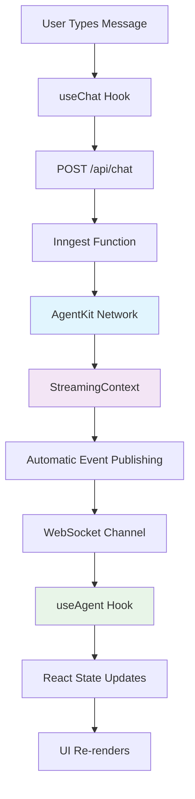

import { Card, CardGroup } from "nextra/components";

AgentKit provides a revolutionary **automatic streaming system** that enables real-time AI chat interfaces without complex setup. Our React hooks package (`@inngest/use-agents`) combines this streaming power with production-ready UI components, making it effortless to build sophisticated AI applications.

## Why Streaming Matters

Traditional AI interfaces require users to wait for complete responses before seeing any output. With AgentKit's streaming system:

- **Immediate Feedback**: Users see responses as they're generated
- **Enhanced UX**: Tool calls, reasoning, and results stream in real-time
- **Perfect Synchronization**: Events arrive in correct order across multiple threads
- **Transparent Integration**: Zero configuration required - streaming happens automatically

<CardGroup>
  <Card
    title="useAgent Hook Demo"
    href="https://github.com/inngest/agent-kit/tree/main/examples/use-agent"
    icon="github"
  >
    Complete Next.js application demonstrating all streaming features
  </Card>
  <Card title="SQL Playground" href="/examples/sql-playground" icon="database">
    Interactive playground showing streaming with ephemeral threads
  </Card>
</CardGroup>

## How It Works

AgentKit's streaming system consists of three major components working seamlessly together:

### 🔄 Automatic Streaming Backend

**StreamingContext** automatically captures and publishes events from your AgentKit networks:

```typescript
// Your existing AgentKit code - no changes needed!
const result = await network.run(message, {
  streaming: {
    publish: async (chunk) => {
      // Events automatically enriched with context
      await publish(userChannel(userId).agent_stream(chunk));
    },
  },
});
```

**15+ Event Types** cover the complete agent lifecycle:

- Lifecycle: `run.started`, `run.completed`, `run.failed`
- Content: `text.delta`, `reasoning.delta`, `tool_call.arguments.delta`
- Parts: `part.created`, `part.completed`
- HITL: `hitl.requested`, `hitl.resolved`
- Control: `usage.updated`, `metadata.updated`

### 🌐 Real-time Transport

**WebSocket Connection** delivers events to your React app instantly:

- Powered by Inngest Realtime for guaranteed delivery
- Automatic reconnection and error recovery
- Channel-based isolation for multi-user scenarios
- Smart connection sharing across components

### ⚛️ React Hook Integration

**Production-ready hooks** consume streaming events and manage UI state:

```typescript
import { useChat, AgentProvider } from '@inngest/use-agents';

function ChatApp() {
  const { messages, sendMessage, status, isConnected } = useChat();

  return (
    <div>
      <div>Status: {status}</div> {/* Updates in real-time */}
      {messages.map(msg => (
        <Message key={msg.id} message={msg} /> {/* Streams as typed */}
      ))}
      <input onSubmit={() => sendMessage(text)} />
    </div>
  );
}
```

## Architecture Overview



## Key Features

### 🔥 Zero Configuration Streaming

- **Automatic**: StreamingContext captures events without code changes
- **Enriched**: Events auto-include threadId, userId, sequence numbers
- **Ordered**: Monotonic sequence numbering prevents UI glitches
- **Resilient**: Best-effort publishing never breaks agent execution

### 🎯 Multi-thread Support

- **Background Streaming**: Receive updates for inactive conversations
- **Thread Isolation**: Perfect event routing to correct conversations
- **Unread Indicators**: Automatic new message tracking
- **Thread Switching**: Instant navigation with history preservation

### 🛡️ Production-Ready Reliability

- **Error Recovery**: Graceful handling of connection failures
- **Out-of-order Events**: Intelligent buffering and reordering
- **Memory Management**: Efficient state management for long conversations
- **Type Safety**: Full TypeScript support throughout

### 🔧 Developer Experience

- **Provider Pattern**: Share connections across components efficiently
- **Transport Abstraction**: Customize API endpoints and authentication
- **Debug Logging**: Comprehensive development-time visibility
- **Hot Reloading**: Seamless development experience

## Next Steps

<CardGroup>
  <Card
    title="Automatic Streaming Deep Dive"
    href="/streaming/automatic-streaming"
  >
    Learn how the StreamingContext system works under the hood
  </Card>
  <Card title="React Hooks Quickstart" href="/streaming/react-hooks-quickstart">
    Build your first streaming chat app in 5 minutes
  </Card>
  <Card title="Hook Selection Guide" href="/streaming/hook-selection-guide">
    Choose the right hook for your use case
  </Card>
  <Card title="Provider Pattern Guide" href="/streaming/provider-pattern">
    Optimize performance with shared connections
  </Card>
</CardGroup>

## Migration from Legacy Patterns

If you're using legacy streaming patterns or local hooks from examples:

```typescript
// Before: Local imports
import { useChat } from "@/hooks";
import { AgentProvider } from "@/contexts/AgentContext";

// After: Package imports
import { useChat, AgentProvider } from "@inngest/use-agents";
```

The API is identical - no functional changes required! The new package provides the same functionality with enhanced reliability, performance, and documentation.
