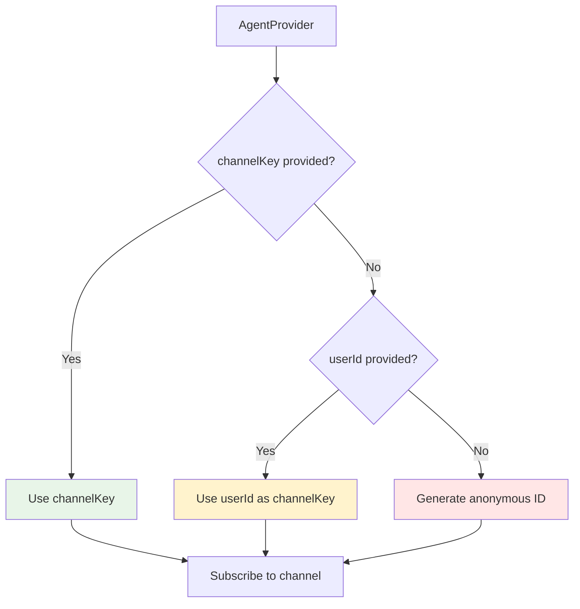

import { Card, CardGroup } from "nextra/components";

The **AgentProvider** is a React context provider that enables efficient connection sharing and simplified configuration across your entire application. It's the foundation for building performant, scalable AI chat interfaces.

<Card title="Performance Impact" icon="chart-line">
Using AgentProvider can reduce WebSocket connections from N (one per component) to 1 (shared across all components), significantly improving performance and reducing server load.
</Card>

## Why Use AgentProvider?

### 🚀 Performance Benefits

**Without Provider** (Multiple Connections):
```typescript
// ❌ Each component creates its own connection
function App() {
  return (
    <div>
      <ChatSidebar />   {/* useThreads → separate WebSocket */}
      <ChatMessages />  {/* useAgent → separate WebSocket */}
      <ChatInput />     {/* useChat → separate WebSocket */}
    </div>
  );
}
// Result: 3 WebSocket connections, 3x memory usage, 3x server load
```

**With Provider** (Shared Connection):
```typescript
// ✅ Single connection shared across all components
function App() {
  return (
    <AgentProvider userId="user-123">
      <ChatSidebar />   {/* Shares WebSocket */}
      <ChatMessages />  {/* Shares WebSocket */}
      <ChatInput />     {/* Shares WebSocket */}
    </AgentProvider>
  );
}
// Result: 1 WebSocket connection, efficient resource usage
```

### 🔧 Configuration Simplification

**Without Provider** (Repeated Configuration):
```typescript
// ❌ Configuration repeated in every component
function ChatSidebar() {
  const threads = useThreads({ 
    userId: "user-123",
    transport: customTransport,
    debug: true 
  });
}

function ChatMessages() {
  const agent = useAgent({ 
    userId: "user-123",      // Repeated
    transport: customTransport, // Repeated  
    debug: true             // Repeated
  });
}
```

**With Provider** (Centralized Configuration):
```typescript
// ✅ Configuration defined once, inherited everywhere
function App() {
  return (
    <AgentProvider 
      userId="user-123"      // Inherited by all hooks
      transport={customTransport}  // Inherited by all hooks
      debug={true}           // Inherited by all hooks
    >
      <ChatSidebar />   {/* Inherits all config */}
      <ChatMessages />  {/* Inherits all config */}
    </AgentProvider>
  );
}

function ChatMessages() {
  // No configuration needed - inherits from provider
  const { messages, sendMessage } = useChat();
}
```

## Core Concepts

### Channel-based Connection Sharing

The provider uses **smart channel-based logic** to determine when to share connections:

```typescript
<AgentProvider userId="user-123">
  {/* All these components use channelKey="user-123" → shared connection */}
  <ChatA />  
  <ChatB />
  <ChatC />
</AgentProvider>
```

But provides **escape hatches** for isolation when needed:

```typescript
<AgentProvider userId="user-123">
  <ChatA />  {/* Uses shared connection for "user-123" */}
  <ChatB channelKey="project-456" />  {/* Separate connection for "project-456" */}
</AgentProvider>
```

### Configuration Inheritance Hierarchy

1. **Hook-level options** (highest priority) 
2. **Provider options** (inherited when available)
3. **Default values** (fallback for anonymous users)

```typescript
<AgentProvider userId="user-123" debug={true} transport={globalTransport}>
  <ComponentA /> {/* Inherits: userId="user-123", debug=true, transport=globalTransport */}
  
  <ComponentB userId="user-456" /> {/* Override: userId="user-456", inherits debug=true, transport=globalTransport */}
  
  <ComponentC transport={customTransport} /> {/* Override: transport=customTransport, inherits userId="user-123", debug=true */}
</AgentProvider>
```

## Usage Patterns

### 1. Basic Authenticated Application

Most common pattern for authenticated users:

```typescript title="app/layout.tsx"
import { AgentProvider } from "@inngest/use-agents";
import { getCurrentUser } from "@/lib/auth";

export default async function RootLayout({ children }) {
  const user = await getCurrentUser();
  
  return (
    <html lang="en">
      <body>
        <AgentProvider 
          userId={user.id}
          debug={process.env.NODE_ENV === 'development'}
        >
          {children}
        </AgentProvider>
      </body>
    </html>
  );
}
```

```typescript title="components/ChatPage.tsx"
"use client";

import { useChat } from "@inngest/use-agents";

export function ChatPage() {
  // Automatically inherits userId and debug from provider
  const { messages, sendMessage, threads } = useChat();
  
  return <ChatInterface {...{ messages, sendMessage, threads }} />;
}
```

### 2. Anonymous/Guest Users

Support for users without accounts:

```typescript title="components/GuestChat.tsx"
import { AgentProvider } from "@inngest/use-agents";

export function GuestChat() {
  return (
    <AgentProvider>  {/* No userId - auto-generates anonymous ID */}
      <GuestChatInterface />
    </AgentProvider>
  );
}

function GuestChatInterface() {
  // Inherits automatically generated anonymous ID
  const { messages, sendMessage } = useChat();
  return <div>/* Guest chat UI */</div>;
}
```

**Behind the scenes**: Provider generates persistent anonymous ID like `"anon_a1b2c3d4"` stored in sessionStorage.

### 3. Collaborative/Multi-user Scenarios

Enable multiple users in the same conversation:

```typescript title="components/ProjectChat.tsx"
import { AgentProvider } from "@inngest/use-agents";

export function ProjectChat({ projectId, currentUser }) {
  return (
    <AgentProvider 
      channelKey={`project-${projectId}`}  // Shared channel
      userId={currentUser.id}              // Individual attribution
    >
      <CollaborativeChatInterface />
    </AgentProvider>
  );
}

function CollaborativeChatInterface() {
  // Multiple users with same channelKey see the same events
  const { messages, sendMessage } = useChat();
  return <div>/* Collaborative chat UI */</div>;
}
```

### 4. Custom Transport Configuration

Centralize API configuration:

```typescript title="lib/transport.ts"
import { createDefaultAgentTransport } from "@inngest/use-agents";

export const customTransport = createDefaultAgentTransport({
  api: {
    sendMessage: '/api/v2/chat',
    fetchThreads: '/api/v2/conversations',
    getRealtimeToken: '/api/v2/realtime/token'
  },
  headers: () => ({
    'Authorization': `Bearer ${getAuthToken()}`,
    'X-API-Version': '2.0',
    'X-User-Role': getCurrentUserRole()
  }),
  baseURL: process.env.NEXT_PUBLIC_API_BASE_URL
});
```

```typescript title="app/layout.tsx"
<AgentProvider 
  userId="user-123"
  transport={customTransport}  // All hooks inherit this transport
>
  <ChatApp />
</AgentProvider>
```

## Advanced Patterns

### Smart Connection Isolation

Mix shared and isolated connections as needed:

```typescript
function App() {
  return (
    <AgentProvider userId="user-123">
      {/* Shared connection for main chat */}
      <MainChat />
      
      {/* Isolated connection for admin panel */}
      <AdminPanel channelKey="admin-panel" />
      
      {/* Shared connection for support */}
      <SupportWidget />
    </AgentProvider>
  );
}
```

**Logic**: Components with the same resolved `channelKey` share connections. Different `channelKey` values get isolated connections.

### Multi-Provider Architecture

Handle complex applications with multiple user contexts:

```typescript
function ComplexApp() {
  return (
    <AgentProvider userId="user-123">
      {/* Main user context */}
      <UserDashboard />
      
      {/* Nested provider for admin context */}
      <AgentProvider userId="admin-456" channelKey="admin-panel">
        <AdminInterface />
      </AgentProvider>
      
      {/* Guest context */}  
      <AgentProvider>
        <GuestSupport />
      </AgentProvider>
    </AgentProvider>
  );
}
```

### Conditional Provider Setup

Handle authentication states gracefully:

```typescript
function App() {
  const { user, isLoading } = useAuth();
  
  if (isLoading) return <LoadingSpinner />;
  
  return user ? (
    // Authenticated: full provider setup
    <AgentProvider 
      userId={user.id}
      transport={authenticatedTransport}
      debug={false}
    >
      <AuthenticatedApp />
    </AgentProvider>
  ) : (
    // Guest: minimal provider setup
    <AgentProvider debug={true}>
      <GuestApp />
    </AgentProvider>
  );
}
```

## Provider Configuration Options

### Core Options

<ParamField path="userId" type="string" default="auto-generated anonymous ID">
User identifier for attribution and data ownership. If not provided, automatically generates a persistent anonymous ID.
</ParamField>

<ParamField path="channelKey" type="string" default="resolved from userId">
Channel key for WebSocket subscription. Enables collaborative features when multiple users share the same key.
</ParamField>

<ParamField path="debug" type="boolean" default="true in development">
Enable comprehensive debug logging for all hooks and connections.
</ParamField>

<ParamField path="transport" type="AgentTransport | Partial<DefaultAgentTransportConfig>" default="default transport">
Transport configuration for API calls. Can be a complete transport instance or configuration object.
</ParamField>

### Transport Configuration Object

```typescript
<AgentProvider 
  transport={{
    api: {
      sendMessage: '/api/custom/chat',
      fetchThreads: '/api/custom/threads',
    },
    headers: {
      'Authorization': `Bearer ${token}`,
      'X-Custom-Header': 'value'
    },
    baseURL: 'https://api.myapp.com'
  }}
>
  <ChatApp />
</AgentProvider>
```

### Transport Instance

```typescript
import { DefaultAgentTransport } from "@inngest/use-agents";

const customTransport = new DefaultAgentTransport({
  // ... custom configuration
});

<AgentProvider transport={customTransport}>
  <ChatApp />
</AgentProvider>
```

## Hook Provider Integration

### Automatic Inheritance

Hooks automatically inherit provider configuration:

```typescript
function ChatComponent() {
  // These hooks automatically inherit userId, transport, etc. from provider
  const chat = useChat();           // ✅ Inherits all config
  const threads = useThreads();     // ✅ Inherits all config  
  const agent = useAgent({ threadId }); // ✅ Inherits all config
}
```

### Selective Override

Override specific options when needed:

```typescript  
function SpecializedComponent() {
  // Override specific options while inheriting others
  const chat = useChat({ 
    userId: "different-user",  // Override userId
    // debug inherited from provider
    // transport inherited from provider
  });
  
  const agent = useAgent({
    channelKey: "isolated-channel", // Separate connection
    // userId inherited from provider
  });
}
```

## Connection Management

### Smart Channel Resolution

The provider resolves channel keys intelligently:



### Connection Lifecycle

```typescript
// Provider creates stable connection on mount
useEffect(() => {
  const connection = createConnection(resolvedChannelKey);
  return () => connection.cleanup();
}, [resolvedChannelKey]); // Only recreate if channel changes

// Child hooks share this connection automatically
const globalAgent = useGlobalAgent(); // Gets shared connection
```

## Debugging Provider Issues

### Connection Verification

Enable debug mode to see connection details:

```typescript
<AgentProvider userId="user-123" debug={true}>
  <ChatApp />
</AgentProvider>

// Console output:
// 🔍 [AgentProvider] Creating agent connection for channelKey: user-123
// ✅ [AgentProvider] Channel subscription token created
// 🔧 [useChat] Inheriting configuration from provider
// 🔄 [useAgent] Using shared connection for channel: user-123
```

### Channel Key Conflicts

Watch for accidental channel key mismatches:

```typescript
// ❌ Provider and hook use different channels → separate connections
<AgentProvider channelKey="user-123">
  <Component channelKey="project-456" />  {/* Separate connection! */}
</AgentProvider>

// ✅ Consistent channel usage → shared connection
<AgentProvider channelKey="project-456">
  <Component />  {/* Inherits channel → shared connection */}
</AgentProvider>
```

### Transport Issues

Verify transport inheritance:

```typescript
// Check if hooks are using the expected transport
const transport = useOptionalGlobalTransport(); // Get provider transport
const localTransport = useLocalTransport();     // Hook-specific transport

console.log('Transport source:', {
  usingGlobal: !!transport,
  hasLocal: !!localTransport,
  effective: transport || localTransport || 'default'
});
```

## Real-world Examples

### E-commerce Support Chat

```typescript title="components/SupportApp.tsx"
import { AgentProvider, createDefaultAgentTransport } from "@inngest/use-agents";

const supportTransport = createDefaultAgentTransport({
  api: {
    sendMessage: '/api/support/chat',
    fetchThreads: '/api/support/threads',
  },
  headers: {
    'X-Support-Context': 'customer-portal',
    'Authorization': `Bearer ${getCustomerToken()}`
  }
});

export function SupportApp({ customerId }) {
  return (
    <AgentProvider 
      userId={customerId}
      transport={supportTransport}
      debug={false} // Production mode
    >
      <SupportChatInterface />
      <SupportSidebar />
      <SupportActions />
    </AgentProvider>
  );
}
```

### Multi-tenant SaaS Application

```typescript title="components/TenantChat.tsx"
export function TenantChat({ tenantId, userId }) {
  const tenantTransport = createDefaultAgentTransport({
    headers: {
      'X-Tenant-ID': tenantId,
      'Authorization': `Bearer ${getTenantToken(tenantId)}`
    },
    baseURL: `https://${tenantId}.api.myapp.com`
  });

  return (
    <AgentProvider 
      userId={userId}
      channelKey={`tenant-${tenantId}-user-${userId}`}
      transport={tenantTransport}
    >
      <TenantChatInterface />
    </AgentProvider>
  );
}
```

### Development vs Production

```typescript title="components/ChatApp.tsx"
const developmentTransport = createDefaultAgentTransport({
  baseURL: 'http://localhost:3000',
  headers: { 'X-Environment': 'development' }
});

const productionTransport = createDefaultAgentTransport({
  baseURL: 'https://api.myapp.com',
  headers: () => ({
    'Authorization': `Bearer ${getProductionToken()}`,
    'X-Environment': 'production'
  })
});

export function ChatApp() {
  return (
    <AgentProvider
      userId="user-123"
      transport={isDevelopment ? developmentTransport : productionTransport}
      debug={isDevelopment}
    >
      <Chat />
    </AgentProvider>
  );
}
```

## Provider Utilities

### Optional Access Hooks

Safely access provider values even outside the provider:

```typescript
import { 
  useOptionalGlobalUserId,
  useOptionalGlobalTransport,
  useOptionalGlobalAgent 
} from "@inngest/use-agents";

function FlexibleComponent() {
  const globalUserId = useOptionalGlobalUserId();     // null if no provider
  const globalTransport = useOptionalGlobalTransport(); // null if no provider
  
  // Graceful fallback when no provider exists
  const effectiveUserId = globalUserId || "fallback-user";
  const effectiveTransport = globalTransport || createDefaultAgentTransport();
}
```

### Strict Access Hooks

For components that require provider context:

```typescript
import { 
  useGlobalAgentStrict,
  useGlobalTransportStrict 
} from "@inngest/use-agents";

function StrictComponent() {
  const agent = useGlobalAgentStrict();     // Throws if no provider
  const transport = useGlobalTransportStrict(); // Throws if no provider
  
  // These components will fail fast if used outside AgentProvider
}
```

## Performance Optimization

### Connection Pooling

For applications with many isolated contexts:

```typescript
// Instead of many providers
function App() {
  return (
    <div>
      <AgentProvider userId="user-1"><Chat1 /></AgentProvider>  {/* Connection 1 */}
      <AgentProvider userId="user-2"><Chat2 /></AgentProvider>  {/* Connection 2 */}
      <AgentProvider userId="user-3"><Chat3 /></AgentProvider>  {/* Connection 3 */}
    </div>
  );
}

// Consider shared provider with channel isolation
function OptimizedApp() {
  return (
    <AgentProvider userId="app-instance">
      <Chat1 channelKey="user-1" />  {/* Separate channels */}
      <Chat2 channelKey="user-2" />  {/* Same connection */}
      <Chat3 channelKey="user-3" />  {/* Better performance */}
    </AgentProvider>
  );
}
```

### Memory Management

```typescript
// ✅ Efficient: Stable provider configuration
const stableTransport = useMemo(() => createDefaultAgentTransport({
  headers: { 'Authorization': `Bearer ${token}` }
}), [token]); // Only recreate when token changes

<AgentProvider transport={stableTransport}>
  <ChatApp />
</AgentProvider>

// ❌ Inefficient: Recreated on every render
<AgentProvider 
  transport={createDefaultAgentTransport({
    headers: { 'Authorization': `Bearer ${token}` }
  })} // New instance every render!
>
  <ChatApp />
</AgentProvider>
```

## Troubleshooting

### Common Issues

**"Hooks not inheriting provider config"**
- Verify components are wrapped with `AgentProvider`
- Check that hooks are called within provider children
- Use debug mode to verify inheritance

**"Multiple connections created unexpectedly"**
- Check for channelKey mismatches between provider and hooks
- Verify stable transport configuration (use `useMemo`)
- Review component hierarchy for nested providers

**"Provider config not updating"**
- Ensure transport/configuration objects are stable
- Use `useMemo` for computed configurations
- Check dependency arrays in effect hooks

### Debug Output

Enable debug mode to see provider activity:

```typescript
<AgentProvider debug={true}>
// Console output:
// 🔍 [AgentProvider] Creating agent connection for channelKey: user-123  
// 🔧 [useChat] Inheriting userId from provider: user-123
// 🔧 [useAgent] Using shared connection for channel: user-123
// ✅ [Connection] WebSocket established for channel: user-123
```

## Best Practices

### ✅ Do

- **Wrap your app early** in the component tree (layout.tsx)
- **Use stable configuration** objects with `useMemo`
- **Leverage inheritance** instead of repeating configuration
- **Enable debug mode** during development
- **Use channelKey** for collaborative features

### ❌ Don't

- **Nest providers unnecessarily** - one provider usually sufficient
- **Recreate transport** configuration on every render
- **Hardcode configuration** - use environment variables
- **Ignore connection sharing** - it significantly improves performance
- **Mix channelKeys carelessly** - understand connection implications

## Next Steps

<CardGroup>
  <Card
    title="Transport Configuration"
    href="/streaming/transport-configuration"
  >
    Learn how to customize API endpoints and authentication
  </Card>
  <Card
    title="useChat API Reference"
    href="/reference/react-hooks/use-chat"
  >
    Complete API documentation for the useChat hook
  </Card>
  <Card
    title="Advanced Streaming Patterns"
    href="/advanced-patterns/multi-threading"
  >
    Handle complex multi-agent scenarios
  </Card>
</CardGroup>

The AgentProvider is the foundation that makes AgentKit's React hooks both powerful and efficient. By centralizing configuration and sharing connections, it enables you to build sophisticated AI applications that scale from simple demos to production systems serving millions of users.
