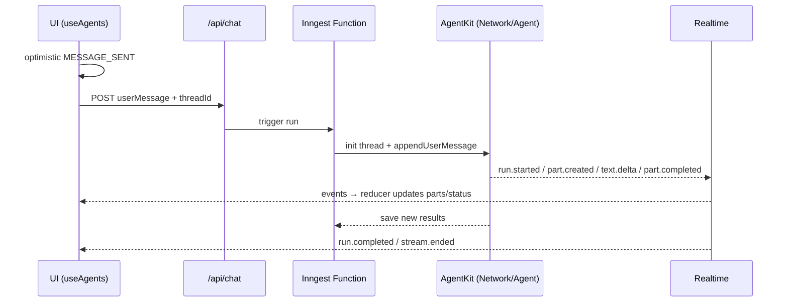

`useAgents` manages realtime messages, thread lists, status, and all key actions in a single hook. It consumes structured streaming events and exposes a simple UI model for rendering conversations.

Message lifecycle:



Key capabilities:

- Realtime event consumption (run.*, part.*, *.delta)
- Thread selection, pagination hooks
- Optimistic send, cancel (if backend supports), tool approvals (optional)

### API

```ts
type UseAgentsConfig = {
  userId?: string;
  channelKey?: string;
  initialThreadId?: string;
  threadsPageSize?: number;
  transport?: IClientTransport;
  requireProvider?: boolean;
  enableThreadValidation?: boolean;
  state?: () => Record<string, unknown>;
  onStateRehydrate?: (messageState: Record<string, unknown>, messageId: string) => void;
  fetchThreads?: (userId: string, pagination: any) => Promise<ThreadsPage>;
  fetchHistory?: (threadId: string) => Promise<unknown[]>;
  createThread?: (userId: string) => Promise<{ threadId: string; title: string }>;
  deleteThread?: (threadId: string) => Promise<void>;
  renameThread?: (threadId: string, title: string) => Promise<void>;
};

type UseAgentsReturn = {
  messages: ConversationMessage[];
  status: "idle" | "thinking" | "calling-tool" | "responding" | "error";
  isConnected: boolean;
  currentAgent?: string;
  error?: AgentError;
  clearError: () => void;

  threads: Thread[];
  threadsLoading: boolean;
  threadsHasMore: boolean;
  threadsError: string | null;
  currentThreadId: string | null;

  isLoadingInitialThread: boolean;

  sendMessage: (message: string, opts?: { messageId?: string }) => Promise<void>;
  sendMessageToThread: (
    threadId: string,
    message: string,
    opts?: { messageId?: string; state?: Record<string, unknown> | (() => Record<string, unknown>) }
  ) => Promise<void>;
  cancel: () => Promise<void>;
  approveToolCall: (toolCallId: string, reason?: string) => Promise<void>;
  denyToolCall: (toolCallId: string, reason?: string) => Promise<void>;

  switchToThread: (threadId: string) => Promise<void>;
  setCurrentThreadId: (threadId: string) => void;

  loadThreadHistory: (threadId: string) => Promise<ConversationMessage[]>;
  clearThreadMessages: (threadId: string) => void;
  replaceThreadMessages: (threadId: string, messages: ConversationMessage[]) => void;

  deleteThread: (threadId: string) => Promise<void>;
  loadMoreThreads: () => Promise<void>;
  refreshThreads: () => Promise<void>;

  createNewThread: () => string;
  rehydrateMessageState: (messageId: string) => void;
};
```

### Minimal usage

```tsx
"use client";
import { useAgents } from "@inngest/agent-kit/use-agents";

export function Chat({ userId, initialThreadId }: { userId: string; initialThreadId?: string }) {
  const {
    messages,
    status,
    isConnected,
    sendMessage,
    createNewThread,
    currentThreadId,
  } = useAgents({ userId, initialThreadId });

  return null; // Render messages and composer in your UI
}
```

### Notes

- Provide `AgentProvider` at the app root to configure transport and connection.
- For demos, session transport supports tab-to-tab resume; production should implement HTTP endpoints and token route.
