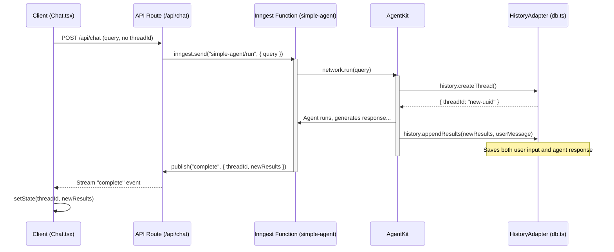
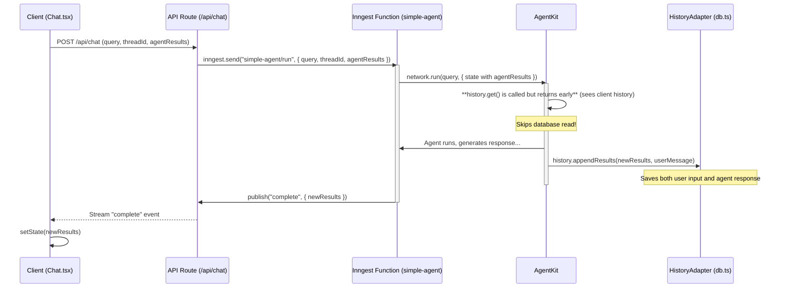
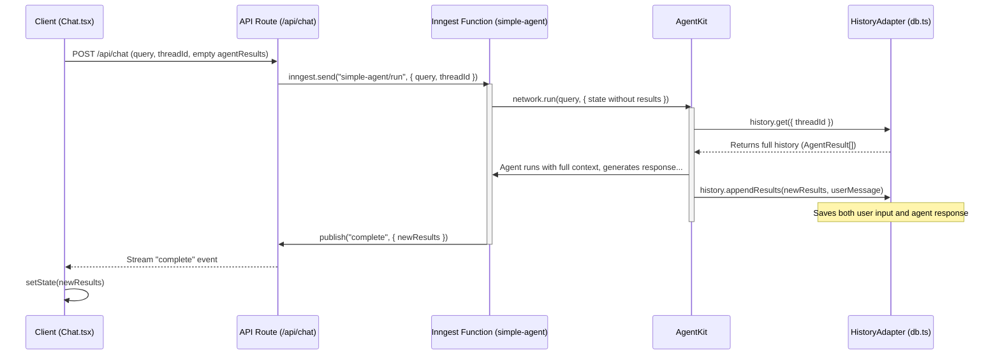

# AgentKit Persistence: A Guide to Conversation History

AgentKit's persistence layer provides a robust framework for creating stateful, long-running conversations with AI agents. By using a `HistoryAdapter`, you can connect your agents to a database, enabling them to remember past interactions and maintain context across multiple sessions.

This guide explores the core concepts of AgentKit's history management, demonstrates its implementation with a full-stack chat application example, and explains the design patterns that make it both powerful and efficient.

## Core Concepts

The history system is built around three main components: the `HistoryConfig` object, the `HistoryAdapter`, and the `State` object.

### 1. `HistoryConfig`

This is a configuration object you pass to a `Network` or `Agent`. It defines the contract for how the agent should interact with your storage layer. It has three optional hooks:

- `createThread(ctx)`: Called when a new conversation starts (i.e., no `threadId` is provided). Its job is to create a new thread in the database and return the unique `threadId`.
- `get(ctx)`: Called at the beginning of a run for an _existing_ thread. It retrieves the conversation history (`AgentResult[]`) from the database.
- `appendResults(ctx)`: Called at the end of a run. It saves only the _new_ messages (`newResults`) generated during that run to the database. **Enhanced in v0.8+**: Now also receives `userMessage` parameter for complete conversation persistence.

### 2. History Adapter

A History Adapter is a class that implements the `HistoryConfig` interface. It abstracts the specific database logic (e.g., SQL queries for PostgreSQL, document operations for MongoDB) away from your agent logic. The example application uses `PostgresHistoryAdapter` found in `inngest/db.ts`.

### 3. State and `threadId`

The `state.threadId` is the key that links a conversation run to its stored history. AgentKit automatically manages passing this `threadId` to the history hooks, ensuring that the correct conversation is loaded and updated.

---

## Enhanced User Message Persistence (v0.8+)

**New Feature**: AgentKit now natively supports persisting user messages alongside agent responses, providing complete conversation history storage.

### Unified Message Persistence

The enhanced `appendResults` hook now receives both agent results and user input:

```typescript
appendResults: async ({ threadId, newResults, userMessage }) => {
  // Save user message first (if provided)
  if (userMessage) {
    await db.saveUserMessage(threadId, {
      content: userMessage.content,
      role: userMessage.role, // "user"
      timestamp: userMessage.timestamp,
    });
  }

  // Then save agent results
  for (const result of newResults) {
    await db.saveAgentResult(threadId, result);
  }
};
```

### Benefits of Unified Persistence

1. **Complete Conversation History**: Both user inputs and agent responses are preserved
2. **Native AgentKit Integration**: No external workarounds needed
3. **Consistent Timestamps**: User messages get accurate timestamps
4. **Unified Storage**: Single system handles all message types

---

## The Hybrid History Pattern: Client-Authoritative & Server Fallback

A key feature of the example application is its "hybrid" approach to history, which optimizes for performance by making the client authoritative whenever possible.

**The Pattern:**

1.  **Client-Side History:** The frontend (`Chat.tsx`) maintains the full conversation history in its state (`agentResults`).
2.  **Optimistic Sending:** For every new message, the client sends its _entire_ history (`agentResults`) along with the `threadId` to the backend.
3.  **Conditional DB Read:** The AgentKit network (`simple-agent.ts`) receives this client-side history. The `history.get` hook is implemented to **skip the database call** if it receives history from the client. This saves a database read on every single turn of the conversation.
4.  **Server Fallback:** If the client _doesn't_ send any history (e.g., on a browser refresh where the state is lost), the `history.get` hook proceeds as normal, loading the conversation from the database.
5.  **Always Write:** The `history.appendResults` hook is always called at the end of a run to persist both user messages and agent results, ensuring the database is always up-to-date for future fallbacks.

**Trade-offs:**

- **Performance (`+`)**: This pattern significantly improves the responsiveness of the chat application by eliminating a database query from the critical path of most conversation turns.
- **Complexity (`-`)**: It requires more state management on the client and a clear contract between the client and backend to handle the `agentResults` payload.
- **Bandwidth (`-`)**: Sending the full history on each request increases the payload size. This is generally acceptable for chat but might be a concern for very long conversations.

## Sequence Diagrams

These diagrams illustrate the flow of a conversation.

### 1. New Conversation

This flow occurs when a user sends the first message. No `threadId` exists yet.



### 2. Existing Conversation (Client-Authoritative)

The common case for subsequent messages. The client sends its history to optimize the flow.



### 3. Existing Conversation (Server Fallback)

This happens on a page refresh. The client has the `threadId` but lost its `agentResults` state.



---

## Implementation Guide

Here's how the pieces fit together in the example application.

### Step 1: Enhanced Database Schema

The foundation is two PostgreSQL tables: `threads` and `messages`. The `initializeTables` function in `inngest/db.ts` creates them.

- **`agentkit_threads`**: Stores one record per conversation, linking a `thread_id` to a `user_id`.
- **`agentkit_messages`**: **Enhanced in v0.8+** - Unified table storing both user messages and agent results with a `message_type` field to distinguish between them. Includes a `UNIQUE(thread_id, checksum)` constraint to prevent duplicate messages.

**Enhanced Schema (v0.8+):**

```sql
CREATE TABLE agentkit_messages (
  id SERIAL PRIMARY KEY,
  thread_id UUID NOT NULL REFERENCES agentkit_threads(thread_id) ON DELETE CASCADE,
  message_type TEXT NOT NULL CHECK (message_type IN ('user', 'agent')),
  agent_name TEXT, -- NULL for user messages, agent name for agent results
  content TEXT, -- User message content (for user messages)
  data JSONB, -- Full AgentResult data (for agent results)
  checksum TEXT NOT NULL,
  created_at TIMESTAMP WITH TIME ZONE DEFAULT NOW(),
  UNIQUE(thread_id, checksum)
);
```

You can set up your database using the script:

```bash
pnpm tsx ./scripts/setup-db.ts
```

### Step 2: Enhanced History Adapter (`db.ts`)

The `PostgresHistoryAdapter` in `inngest/db.ts` implements the database logic for the three `HistoryConfig` hooks.

- **`createThread`**: Inserts a new row into the `threads` table and returns the `thread_id`.
- **`get`**: Selects all **agent messages** for a given `thread_id`, reconstructs them into `AgentResult` class instances, and returns them. User messages are handled separately by the framework.
- **`appendResults`**: **Enhanced in v0.8+** - Begins a transaction, updates the `threads` table's `updated_at` timestamp, inserts user message (if provided), and inserts all `newResults` into the `messages` table using `ON CONFLICT DO NOTHING`.

**Enhanced appendResults Implementation:**

```typescript
appendResults: async ({ threadId, newResults, userMessage, step }) => {
  const client = await this.pool.connect();

  try {
    await client.query("BEGIN");

    // Insert user message if provided
    if (userMessage) {
      const userChecksum = `user_${userMessage.timestamp.getTime()}_${userMessage.content.substring(
        0,
        50
      )}`;
      await client.query(
        `
        INSERT INTO ${this.tableNames.messages} (thread_id, message_type, content, checksum, created_at)
        VALUES ($1, 'user', $2, $3, $4)
        ON CONFLICT (thread_id, checksum) DO NOTHING
      `,
        [threadId, userMessage.content, userChecksum, userMessage.timestamp]
      );
    }

    // Insert agent results
    for (const result of newResults) {
      await client.query(
        `
        INSERT INTO ${this.tableNames.messages} (thread_id, message_type, agent_name, data, checksum)
        VALUES ($1, 'agent', $2, $3, $4)
        ON CONFLICT (thread_id, checksum) DO NOTHING
      `,
        [threadId, result.agentName, result.export(), result.checksum]
      );
    }

    await client.query("COMMIT");
  } catch (error) {
    await client.query("ROLLBACK");
    throw error;
  } finally {
    client.release();
  }
};
```

### Step 3: Network Configuration (`simple-agent.ts`)

The Inngest Function in `simple-agent.ts` configures the AgentKit Network to use the `PostgresHistoryAdapter`. This is where the hybrid logic lives.

```typescript
// inngest/functions/simple-agent.ts

const historyAdapter = new PostgresHistoryAdapter<NetworkState>(
  config.database
);

// ... inside the Inngest function ...

const initialHistory = agentResults.map(/* ...reconstruct AgentResult... */);

const simpleNetwork = createNetwork<NetworkState>({
  // ... other network config
  history: {
    createThread: async (ctx) => {
      // AgentKit will call this if state.threadId is missing
      return await historyAdapter.createThread(ctx);
    },

    get: async (ctx) => {
      // If client provided history, skip database read
      if (initialHistory.length > 0) {
        console.log("⚡ Skipping database read - using client history");
        return []; // Return empty, AgentKit uses `initialHistory` from state
      }

      // Otherwise, load from database
      return await historyAdapter.get(ctx);
    },

    appendResults: async (ctx) => {
      // Always save new results AND user message to the database
      // ctx now includes userMessage parameter automatically
      return await historyAdapter.appendResults(ctx);
    },
  },
  // ... router, etc.
});
```

### Step 4: Backend API (`route.ts`)

The Next.js API route at `app/api/chat/route.ts` is the entry point. Its role is simple:

1.  Parse the incoming JSON body (`query`, `threadId`, `agentResults`).
2.  Trigger the `simple-agent/run` Inngest function, passing along the data.
3.  Use `@inngest/realtime` to subscribe to a unique channel (`chat.${threadId}` or a temporary one) and stream events back to the client.

```typescript
// app/api/chat/route.ts

// ...
export async function POST(req: Request) {
  const body = (await req.json()) as ChatRequest;
  const { query, threadId, userId, agentResults = [] } = body;

  // Use threadId for channel if it exists, otherwise create a temporary one
  const channelId = threadId || `temp-${Date.now()}`;

  // Trigger the durable agent workflow
  await inngest.send({
    name: "simple-agent/run",
    data: {
      query,
      threadId, // May be undefined
      userId,
      agentResults,
      tempChannelId: !threadId ? channelId : undefined,
    },
  });

  // Subscribe to the channel and stream events back to the client
  const stream = await subscribe({
    app: inngest,
    channel: `chat.${channelId}`,
    topics: ["messages"],
  });

  return new Response(stream.getEncodedStream(), {
    /* ... headers ... */
  });
}
```

### Step 5: Frontend (`Chat.tsx`)

The `Chat.tsx` component manages the UI and the client-side history state.

1.  **State Management**: It uses `useState` to hold `messages` (for display), `agentResults` (the full history to send back), and `threadId`.
2.  **Submitting a Message**: The `handleSubmit` function is the core of the client-side logic.
    - It optimistically adds the user's message to the UI.
    - It adds the user's message to its `agentResults` array.
    - It sends the `query`, the current `threadId` (which is `null` on the first request), and the entire `agentResults` array to the `/api/chat` endpoint.
3.  **Handling the Response**:
    - It reads the server-sent event stream.
    - When it receives a `message` event, it adds the assistant's message to the UI.
    - When it receives the final `complete` event:
      - It saves the `threadId` returned by the server. Now all future requests in this conversation will use this ID.
      - It appends the `newResults` from the event data to its own `agentResults` state, keeping its history in sync with the backend.

This completes the client-server loop, enabling a fast, stateful, and durable chat experience with **complete conversation history persistence** including both user inputs and agent responses.

---

## ChatGPT-Style Thread Management (v0.8+)

**New Feature**: The example application now includes a complete ChatGPT-style sidebar for managing conversation threads.

### Thread Management Features

1. **Thread Listing**: View all past conversations grouped by date
2. **Thread Switching**: Click to load any previous conversation
3. **Thread Deletion**: Remove conversations with confirmation
4. **New Chat**: Start fresh conversations
5. **Complete History Rehydration**: Load both user and agent messages from database

### Additional API Endpoints

```typescript
// GET /api/threads - List all threads for user
// GET /api/threads/[threadId]/history - Get complete conversation history
// DELETE /api/threads/[threadId] - Delete a thread and all messages
```

This provides a complete chat application experience with persistent, manageable conversation history.
