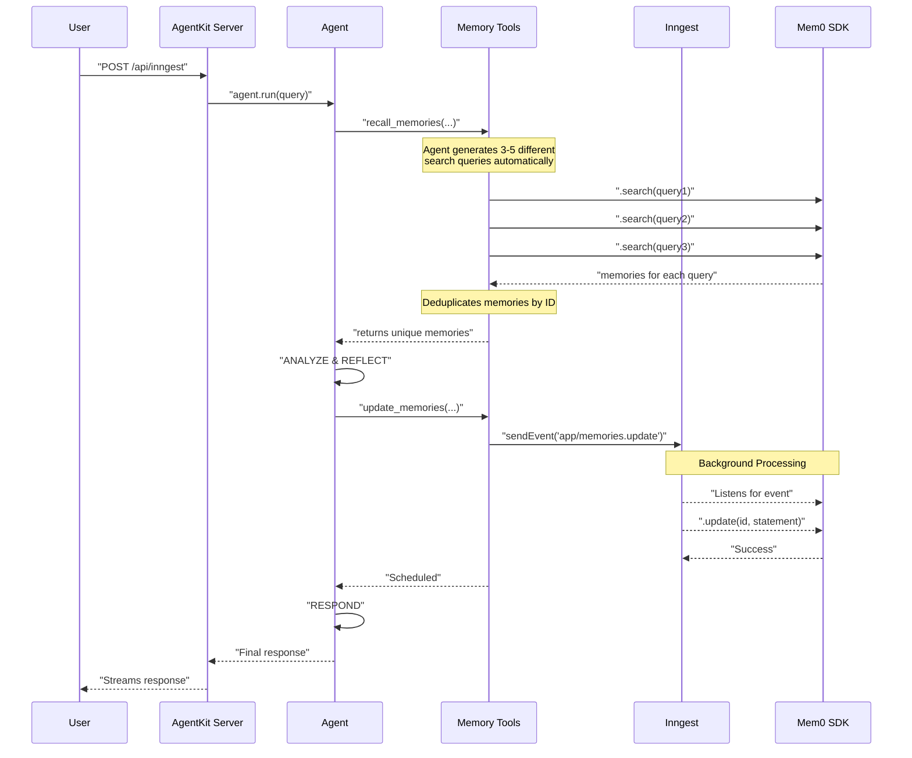
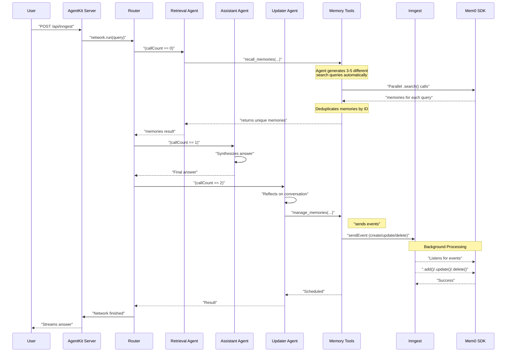

# Long Term Memory with AgentKit + Mem0

This directory contains two examples demonstrating how to integrate [mem0](https://docs.mem0.ai/overview) for memory management within AgentKit.

1.  **Single Agent with Tools (`index.ts`)**: A full non-deterministic approach where a single agent decides when to recall, create, update, or delete memories based on its system prompt and past messages
2.  **Multi-Agent Network (`multi-agent.ts`)**: A more deterministic approach using a router to orchestrate a sequence of specialized agents for memory retrieval, response generation and memory updates

A key advantage of combining Mem0 with AgentKit is the power of Inngest for handling memory operations. In these examples, you'll see that when an agent needs to create, update, or delete a memory, it doesn't block the conversation. Instead, it sends an event using Inngest's `step.sendEvent()`.

This means:

⚡ **Faster Responses:** Your agent can respond to the user immediately, without waiting for the database write to complete.

🔄 **Durable Background Processing:** The memory operation runs reliably in the background as a separate, durable Inngest function. If it fails, Inngest automatically retries it.

🔗 **Seamless Integration:** This powerful asynchronous pattern is a native part of the AgentKit and Inngest framework. You get all the benefits of a robust, event-driven architecture for your agent's memory, making your application faster and more resilient.

## Getting Started

1.  **Clone the repository** and navigate to this directory.
2.  **Install dependencies**:
    ```bash
    npm install
    ```
3.  **Set up environment variables**: Create a `.env` file by copying `.env.example` and fill in your API keys.

    _Note: We are currently only using OpenAI in this example and Mem0 is by default configured to use `OPENAI_API_KEY` for LLM inference and to generate embeddings)_

4.  **Start Qdrant**: Run the local vector database using Docker.

    ```bash
    docker-compose up
    ```

    _Once Qdrant is running, you can view all stored memories and database entries by visiting the Qdrant web interface at [http://localhost:6333](http://localhost:6333)_

5.  **Start the Inngest Dev Server**: This allows you to view traces and invoke your agents.
    ```bash
    npx inngest-cli@latest dev
    ```
6.  **Run an example**:
    - For the **multi-agent** example, run:
      ```bash
      npm run start-multi
      ```
    - For the **single-agent** example, run:
      ```bash
      npm run start
      ```
7.  **Invoke the Agent**: Go to the Inngest Dev Server UI (usually `http://localhost:8288`), navigate to the "Functions" tab and invoke either the `reflective-mem0-network` (single-agent) or `multi-agent-memory-network` with a query.

    **Example 1 - Creating a memory:**

    ```json
    {
      "data": {
        "input": "I love to eat pizza"
      }
    }
    ```

    **Expected behavior:** If this is your first interaction (empty database), the agent will:

    - Call `recall_memories` to search for relevant memories (will find none)
    - Respond to your statement
    - Create a new memory storing "User loves to eat pizza"
    - You can verify this by checking Qdrant at http://localhost:6333

    **Example 2 - Updating/Deleting a memory:**

    ```json
    {
      "data": {
        "input": "I don't like eating pizza anymore"
      }
    }
    ```

    **Expected behavior:** The agent will:

    - Call `recall_memories` and find the previous "loves pizza" memory
    - Recognize the contradiction
    - Depending on the agent's decision, it may:
      - **Delete** the old "loves pizza" memory AND/OR
      - **Update** it to "User doesn't like eating pizza anymore" OR
      - **Create** a new memory while deleting the old one
    - The exact behavior depends on whether you're using the single-agent (non-deterministic) or multi-agent (deterministic) approach

    **Note:** All memory operations (create, update, delete) happen asynchronously in the background via Inngest events, so your agent can respond immediately while the memory changes are processed durably.

    **Example 3 - Multiple operations (multi-agent example):**

    ```json
    {
      "data": {
        "input": "I want to start eating healthier and working out every day. I need to stop eating pizza."
      }
    }
    ```

    **Expected behavior with multi-agent network:** When using the multi-agent example, the system can handle multiple memory operations efficiently:

    - The **Memory Retrieval Agent** will search for any existing memories about eating habits and exercise
    - The **Personal Assistant Agent** will acknowledge your health goals
    - The **Memory Updater Agent** will analyze the entire conversation and may perform multiple operations simultaneously:
      - **Delete** or **Update** the old "loves pizza" memory
      - **Create** new memories like "User wants to eat healthier"
      - **Create** another memory like "User wants to work out daily"
    - All these operations are handled by a dedicated `memory-updater-agent` in a single call to `manage_memories` in this multi-agent approach

## How Memory Recall Works

The `recall_memories` tool is designed to perform several searches in parallel by generating multiple search queries and searching via the Mem0 using `step.run`. Let's take a closer look at how this all works under the hood...

### Multiple Query Generation

When an agent uses the `recall_memories` tool, it must provide between 3-5 different search queries (configurable). This ensures thorough memory retrieval by:

- Searching from different angles and perspectives
- Using various keywords and phrasings
- Capturing related memories that might use different terminology

### Deduplication Process

Since multiple queries often return overlapping results:

1. Each query runs in parallel for faster performance
2. All returned memories are collected
3. Duplicates are automatically removed by memory ID
4. Only unique memories are returned by the tool and added to the message history

### Configuration Options

You can customize the memory recall behavior by modifying these constants in `memory-tools.ts`:

```typescript
const MIN_RECALL_QUERIES = 3; // Minimum queries required
const MAX_RECALL_QUERIES = 5; // Maximum queries allowed
const TOP_K_RECALL = 5; // Max memories per query
const MAX_UPDATE_OPERATIONS = 10; // Max concurrent updates
const MAX_DELETE_OPERATIONS = 10; // Max concurrent deletes
```

For example, if you want more comprehensive searches:

- Increase `MIN_RECALL_QUERIES` and `MAX_RECALL_QUERIES` for more search "angles"
- Increase `TOP_K_RECALL` to retrieve more memories per query

This multi-query approach ensures that agents have comprehensive context from past conversations, even when users phrase things differently or when memories are stored with varying terminology.

## Single Agent vs Multi-Agent

Below are detailed explanations and sequence diagrams for each example we have created 👇

### Example 1: Single Agent with Tools (Non-Deterministic)

In this setup (`index.ts`), a single agent is responsible for all tasks. Its system prompt instructs it to follow a recall-reflect-respond process. The agent uses its own reasoning (powered by the LLM) to decide which memory tool to use at any given time, making the flow non-deterministic and autonomous.

**Flow:**

1.  The agent receives a user query.
2.  It first calls the `recall_memories` tool to fetch relevant context from the past.
3.  Based on the recalled memories and the new query, it "reflects" and decides if any memories need to be created, updated, or deleted, using the appropriate tools (`create_memories`, `update_memories`, `delete_memories`). These write operations are sent as events to Inngest for background processing.
4.  Finally, the agent formulates and returns a response to the user.



While powerful, the single agent, non-deterministic approach has potential downsides:

- **Unpredictability:** Because the agent decides on its own which tools to use and when, its behavior can be unpredictable. It might perform multiple memory operations in a loop, get stuck, or fail to answer the user's question directly.
- **Lack of Control:** It can be difficult to enforce a strict workflow. For example, you can't guarantee that the agent will _always_ recall memories before answering, or that it will _always_ reflect on the conversation afterward.
- **Complexity in Prompting:** The system prompt has to be very carefully crafted to guide the agent through the complex recall-reflect-respond process, which can be brittle.

To address these issues, you can adopt a more deterministic, multi-agent paradigm, as shown in the next example.

### Example 2: Multi-Agent Network (Deterministic)

In this setup (`multi-agent.ts`), the workflow is broken down into a sequence of specialized agents orchestrated by a [deterministic, code-based router](https://agentkit.inngest.com/concepts/routers#code-based-routers-supervised-routing). This ensures a more predictable and controllable process.

**Flow:**

1.  **Memory Retrieval Agent**: The router first calls this agent, whose sole job is to use the `recall_memories` tool.
2.  **Personal Assistant Agent**: The router then passes the conversation and recalled memories to this agent. It has no tools and its only job is to synthesize the final answer for the user.
3.  **Memory Updater Agent**: Finally, the router calls this agent. It reviews the _entire_ conversation (initial query, recalled memories, and final answer) and uses the `manage_memories` tool to perform one or more necessary creations, updates or deletions - sending Inngest events to perform each create/update/delete operation asynchronously in the background.



## Alternative Patterns

### Using Network State for Routing Decisions

In the multi-agent example, we demonstrate using `callCount` to determine which agent to run next:

```typescript
router: async ({ callCount, network }) => {
  if (callCount === 0) {
    return memoryRetrievalAgent;
  }
  if (callCount === 1) {
    return personalAssistantAgent;
  }
  if (callCount === 2) {
    return memoryUpdaterAgent;
  }
  return undefined;
};
```

While this approach works well for simple, sequential workflows, you can achieve more flexibility by using network state to track the workflow progress:

```typescript
// Define your network state interface
interface NetworkState {
  memoriesRetrieved?: boolean;
  memories?: Array<{ id: string; memory: string }>;
  assistantResponded?: boolean;
  finalAnswer?: string;
  memoriesUpdated?: boolean;
}

// Use state-based routing instead of call count
router: async ({ network }) => {
  const state = network.state.data;

  // First, check if we need to retrieve memories
  if (!state.memoriesRetrieved) {
    return memoryRetrievalAgent;
  }

  // Then, generate the response if we haven't yet
  if (state.memoriesRetrieved && !state.assistantResponded) {
    return personalAssistantAgent;
  }

  // Finally, update memories if needed
  if (state.assistantResponded && !state.memoriesUpdated) {
    return memoryUpdaterAgent;
  }

  // All done
  return undefined;
};
```

State-based routing is especially powerful in multi-agent networks where each agent has unique memory needs. For example, a "coder" agent and a "project manager" agent need different types of context.

With state-based memory retrieval, you can design more sophisticated memory retrieval flows:

- The router can identify which agent is about to run.
- It can then trigger a memory retrieval step with search queries specifically curated for that agent's role.
- The results can be stored in distinct parts of the network state (e.g., `state.data.coderMemories`, `state.data.pmMemories`).
- This ensures each agent gets precisely the context it needs without cluttering the shared message history.

### Integrating Memory Management into Lifecycles

While the examples in this repo use explicit tools (`recall_memories`, `manage_memories`), you can also integrate memory operations directly into the **agent or network lifecycles** for a more seamless approach.

- **Memory Retrieval in `onStart`**: Use the `onStart` lifecycle hook to fetch memories _before_ an agent's main logic runs. The retrieved memories can be added to the agent's prompt or stored in the network state.

  ```typescript
  const agentWithLifecycleMemory = createAgent({
    // ... agent config ...
    lifecycle: {
      async onStart({ input, history, prompt, network }) {
        // 1. Fetch memories using a custom utility
        const memories = await recallMemoriesForAgent(input);

        // 2. Add memories to the prompt for context
        const memoryMessages = formatMemoriesAsMessages(memories);
        prompt.push(...memoryMessages);

        // Allow the agent to proceed with the enriched prompt
        return { prompt, history, stop: false };
      },
      async onFinish({ result, network }) {
        // 1. Analyze the full conversation to decide on memory operations.
        // This could be a simple rule-based function or another LLM call.
        await analyzeAndManageMemories(result, network.state.data);
      },
    },
  });
  ```

- **Memory Updates in `onFinish`**: Use the `onFinish` hook to reflect on the conversation and schedule memory updates _after_ the agent has completed its turn.

## Mem0 Configuration

We are currently using the open source [`mem0ai` package](https://github.com/mem0ai/mem0/tree/main/mem0-ts/src/oss) which allows you to easily configure custom embedders, prompts and other parameters needed to fully tailor and fine-tune the retrieval process to work best for your use-cases. By default, Mem0 uses this config but you can easily overwrite any of it like we have to integrate a local instance of qdrant:

```typescript
const mem0 = new Memory({
  vectorStore: {
    provider: "qdrant",
    config: {
      collectionName: "agent-kit-memories",
      url: "http://localhost:6333",
      // The default embedding model is text-embedding-3-small which has 1536 dimensions.
      dimension: 1536,
    },
  },
});
```

You can even [leverage a graph database](https://docs.mem0.ai/open-source/graph_memory/overview) for a more sophisticated means of storing and tracking memories - allowing you to leverage the strengths of both vector-based and graph-based approaches, resulting in more accurate and comprehensive information retrieval and generation.

For more on Mem0 concepts, check out this guide in their docs discussing [Memory Operations](https://docs.mem0.ai/core-concepts/memory-operations).
