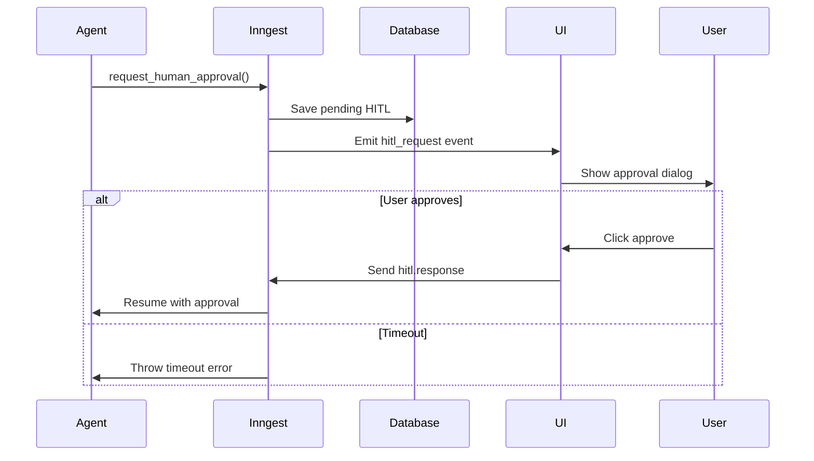

# Voice Assistant Enhanced Features

This document describes the enhanced features added to the Voice Assistant example, including enriched event streams, human-in-the-loop (HITL) support, and conversation branching.

## Table of Contents

1. [Overview](#overview)
2. [Enriched Event Stream](#enriched-event-stream)
3. [Human-in-the-Loop (HITL)](#human-in-the-loop-hitl)
4. [Conversation Branching](#conversation-branching)
5. [Database Schema Updates](#database-schema-updates)
6. [UI Enhancements](#ui-enhancements)
7. [Setup Instructions](#setup-instructions)

## Overview

The enhanced Voice Assistant now provides:

- **Enriched Event Streams**: Multiple event types for full observability
- **Human-in-the-Loop**: Durable approval workflows with Inngest
- **Conversation Branching**: Support for non-linear conversation history
- **Debug View**: Real-time event stream visualization
- **CopilotKit Compatibility**: Event patterns aligned with CopilotKit's approach

## Enriched Event Stream

### Event Types

The system now emits multiple event types for complete observability:

```typescript
// Thought events - Agent's internal reasoning
{
  type: 'thought',
  agentName: string,
  content: string,
  timestamp: Date
}

// Tool call events - When an agent invokes a tool
{
  type: 'tool_call',
  agentName: string,
  toolName: string,
  input: any,
  timestamp: Date
}

// Tool result events - Tool execution results
{
  type: 'tool_result',
  agentName: string,
  toolName: string,
  result: any,
  timestamp: Date
}

// Final message events - User-facing responses
{
  type: 'final_message',
  content: string,
  timestamp: Date
}

// HITL request events - Human approval requests
{
  type: 'hitl_request',
  messageId: string,
  agentName: string,
  request: string,
  details?: string,
  options?: string[],
  expiresAt: Date,
  timestamp: Date
}

// HITL response events - Human decisions
{
  type: 'hitl_response',
  messageId: string,
  approved: boolean,
  response?: string,
  timestamp: Date
}
```

### Subscribing to Events

```typescript
const subscription = await subscribe({
  app: inngest,
  channel: `voice-assistant.${sessionId}`,
  topics: [
    "thought",
    "tool_call",
    "tool_result",
    "final_message",
    "hitl_request",
    "hitl_response",
    "hitl_timeout",
  ],
});
```

## Human-in-the-Loop (HITL)

### Available HITL Tools

1. **Request Human Approval**

   ```typescript
   await request_human_approval({
     action: "Send email to customer",
     details: "Email content: ...",
     options: ["Approve", "Deny", "Modify"],
     timeoutMinutes: 5,
   });
   ```

2. **Ask Human for Input**

   ```typescript
   await ask_human_for_input({
     question: "What should be the email subject?",
     context: "Customer inquiry about refund",
     suggestions: ["Re: Your refund request", "Update on your order"],
     timeoutMinutes: 5,
   });
   ```

3. **Notify Human and Wait**
   ```typescript
   await notify_human_and_wait({
     notification: "Important: Database backup completed",
     severity: "info",
     requiresAcknowledgment: true,
     timeoutMinutes: 5,
   });
   ```

### HITL Flow



### Durable Execution

HITL uses Inngest's `step.waitForEvent` for durable pausing:

- Workflow pauses without consuming resources
- Automatic timeout handling
- State persistence across restarts
- Reliable event delivery

## Conversation Branching

### Database Schema

Messages now support parent-child relationships:

```sql
-- Each message has a unique ID and optional parent
message_id UUID DEFAULT gen_random_uuid() NOT NULL,
parent_message_id UUID REFERENCES messages(message_id),

-- Threads track pending HITL requests
pending_hitl_message_id UUID,
hitl_expires_at TIMESTAMP WITH TIME ZONE
```

### Branching Operations

1. **Create a branch**: Set `parent_message_id` when creating a new message
2. **Navigate branches**: Use the `get_conversation_branch()` function
3. **List branches**: Query messages with the same thread but different parents

### Example: Conversation Tree

```
Message 1 (User: "Book a flight")
├── Message 2 (Agent: "Where would you like to go?")
│   ├── Message 3 (User: "Paris")  <- Branch A
│   │   └── Message 4 (Agent: "Booking Paris flight...")
│   └── Message 5 (User: "London") <- Branch B
│       └── Message 6 (Agent: "Booking London flight...")
```

## Database Schema Updates

Run the migration to add new features:

```bash
pnpm migrate
```

### New Columns

- `message_id`: Unique identifier for each message
- `parent_message_id`: Reference to parent for branching
- `event_type`: Type of event (user_message, thought, tool_call, etc.)
- `event_data`: JSONB field for event metadata
- `pending_hitl_message_id`: Active HITL request
- `hitl_expires_at`: HITL timeout timestamp

### New Functions

- `get_conversation_branch(message_id)`: Get all messages in a branch
- `agentkit_conversation_branches`: View for branch traversal

## UI Enhancements

### New Modes

1. **HITL Approval Mode** (`AWAITING_APPROVAL`)

   - Automatic activation when HITL request received
   - Option selection or text input
   - Keyboard shortcuts for approve/deny

2. **Debug View Mode** (Press `v`)
   - Real-time event stream visualization
   - Chronological event display
   - Detailed event metadata

### Enhanced Display

- **Thought bubbles**: 💭 Blue text for agent reasoning
- **Tool calls**: 🔧 Yellow text for tool invocations
- **Tool results**: ✅ Green text for completions
- **HITL requests**: 🤝 Red text for approval needs

### Keyboard Shortcuts

- `v`: Open debug view
- `d`: Toggle debug mode
- `h`: View conversation history
- `n`: New conversation thread
- `↑/↓`: Navigate options in HITL mode
- `Enter`: Approve HITL request
- `Esc`: Deny HITL request

## Setup Instructions

1. **Install dependencies**

   ```bash
   pnpm install
   ```

2. **Run database migration**

   ```bash
   pnpm migrate
   ```

3. **Start Inngest dev server**

   ```bash
   npx inngest-cli@latest dev
   ```

4. **Start the voice assistant**

   ```bash
   pnpm dev
   ```

5. **Start the CLI interface**
   ```bash
   pnpm cli
   ```

## Usage Examples

### Example 1: Email with Approval

```
User: "Send an email to john@example.com about the meeting"
Agent: [Requests approval]
UI: Shows approval dialog with email preview
User: Approves
Agent: "Email sent successfully!"
```

### Example 2: Debug View

Press `v` to see:

```
[10:23:45] 💭 memory-retriever: Searching for relevant memories...
[10:23:46] 🔧 memory-retriever → search_memories
[10:23:47] ✅ search_memories completed
[10:23:47] 💭 assistant: Based on your history...
[10:23:48] 🔧 assistant → send_email
[10:23:48] 🤝 Approval: Send email to customer
```

### Example 3: Conversation Branching

```typescript
// Set parent for branching
historyAdapter.setCurrentParentMessageId(messageId);

// Create new branch from this point
await submitTextQuery("Actually, let's try a different approach");
```

## Architecture Benefits

1. **Full Observability**: Every agent action is visible
2. **Durable Workflows**: HITL requests survive restarts
3. **Non-linear History**: Support for "what-if" scenarios
4. **CopilotKit Ready**: Compatible event patterns
5. **Debug-Friendly**: Rich event stream for troubleshooting

## Future Enhancements

- [ ] UI branch visualization
- [ ] Branch merging capabilities
- [ ] Event replay functionality
- [ ] Export conversation trees
- [ ] Multi-user HITL workflows
