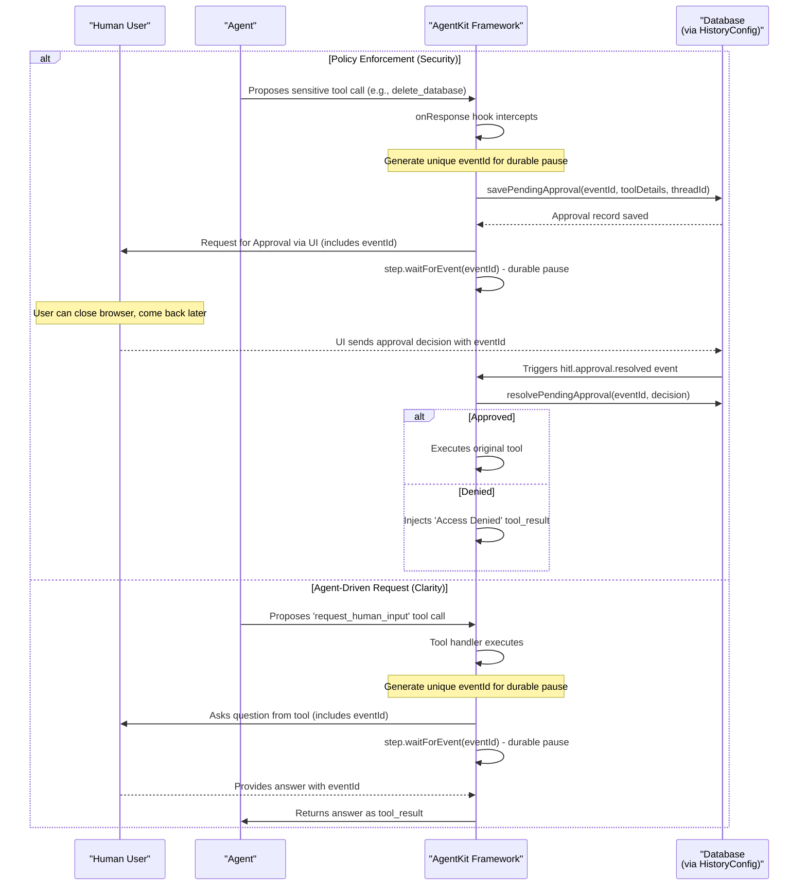
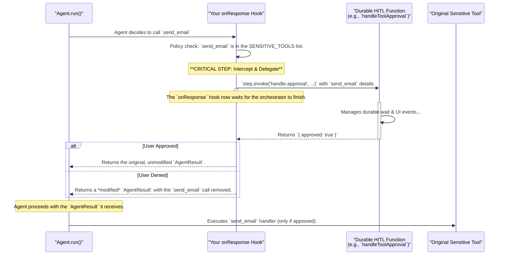

## Specification: Tool Approval & HITL Workflow in AgentKit

### Introduction

This specification details how one might go about implementing a tool approval workflow for their AgentKit network. We will begin by taking a closer look at how we can implement this today without any changes to the core framework before thinking about what this could look like if we made some changes to AgentKit framework.

While there are a few ways to implement a human in the loop mechanism, they are all foundationally centered around the ingest step.waitForEvent function - which requires that users provide an ID for the event that we want to wait for. This ID then needs to be sent back to a client application and/or persisted to a database such as to enable the client application to send this event with the expected payload at some point in the future.

In doing so, we are pausing execution of the network or agent run in order to process this waitForEvent.

With that said, there are two key scenarios in which wait for event is likely to be needed within AgentKit. First is when you want to ensure that the user actually wants to run a particular tool and/or to request for approval to run that tool. Second is we could provide an AI agent, a human in the loop tool.



Let's take a closer look at how we could go about implementing this today using deterministic policy enforcement as well as a non-deterministic agent tool approach.

---

#### **Pattern 1: Deterministic Policy Enforcement (Recommended)**

This is the primary method for enforcing security and control. It works by intercepting an agent's decision to use a tool and forcing an approval flow based on a defined policy. **The LLM is not involved in the decision to request approval; the framework enforces it.**

**Architectural Flow:**

1.  **Define a Policy:** Create a static list of tool names that are considered sensitive and require approval

    ```typescript
    const SENSITIVE_TOOLS = ["send_email", "delete_database"];
    ```

2.  **The `onResponse` Hook as a Policy Enforcement Point:** This lifecycle hook intercepts tool calls _before_ execution

3.  **Wait for Event:** If a sensitive tool is detected, invoke `step.waitForEvent` w/ tools to be invoked to begin the human-in-the-loop process

4.  **Persist & Process Event:** Save the ID of the event we are waiting for to a database and/or send back to your client using a realtime event via `publish()`

5.  **Process the Response:** Send event with approved tools and reinitiate the network run

**Sequence Diagram:**



**Implementation Example:**

```typescript
// Define your security policy as a static list of tool names.
const SENSITIVE_TOOLS = ["send_email", "delete_database"];

// In your network definition
createNetwork({
  // ...
  lifecycle: {
    async onResponse({ agent, result, network, step }): Promise<AgentResult> {
      // 1. Find all tool calls in the agent's proposed plan.
      const allToolCalls = result.output.flatMap((message) =>
        message.type === "tool_call" ? message.tools : []
      );

      // 2. Filter to find which ones are sensitive based on our policy.
      const callsToApprove = allToolCalls.filter((toolCall) =>
        SENSITIVE_TOOLS.includes(toolCall.name)
      );

      if (callsToApprove.length === 0) {
        return result; // No approvals needed, proceed.
      }

      // 3. We have sensitive calls. Invoke our HITL orchestrator.
      const approvalResults = await step.invoke("handle-approvals", {
        function: hitlOrchestrator, // A separate Inngest function, NOT a tool.
        data: {
          calls: callsToApprove.map((c) => ({
            toolName: c.name,
            toolInput: c.input,
            originalCallId: c.id,
          })),
          threadId: network.state.threadId,
          sessionId: network.state.data.sessionId,
        },
      });

      // 4. Handle approved vs denied tools
      const deniedToolResults = [];
      result.output = result.output
        .map((message) => {
          if (message.type === "tool_call") {
            // Separate approved from denied tools
            const approvedTools = [];
            message.tools.forEach((tool) => {
              const approval = approvalResults.find(
                (res) => res.originalCallId === tool.id
              );
              if (approval?.approved) {
                approvedTools.push(tool);
              } else if (approval && !approval.approved) {
                // Create a "denied" tool result for conversation continuity
                deniedToolResults.push({
                  role: "tool_result" as const,
                  type: "tool_result" as const,
                  tool: {
                    type: "tool" as const,
                    id: tool.id,
                    name: tool.name,
                    input: tool.input,
                  },
                  content: {
                    error: `Access denied: The tool '${tool.name}' requires approval and was not permitted.`,
                  },
                  stop_reason: "tool" as const,
                });
              }
            });
            message.tools = approvedTools;
          }
          return message;
        })
        // Remove any tool_call messages that are now empty
        .filter((m) => m.type !== "tool_call" || m.tools.length > 0);

      // 5. Add the denied tool results to maintain conversation continuity
      result.output = [...result.output, ...deniedToolResults];

      return result;
    },
  },
});
```

### **Database Persistence for Durable Approvals**

The critical component missing from the above implementation is **database persistence**. The `eventId` that `step.waitForEvent()` waits for must be stored in a database so that:

1. The UI can query for pending approvals and display them to users
2. Users can close their browser and return later to approve/deny requests
3. The approval state survives server restarts and network interruptions

**Extending the HistoryConfig Interface:**

We recommend extending the existing `HistoryConfig` interface with new optional methods for managing pending approvals:

```typescript
// Extension to the existing HistoryConfig interface
export interface HistoryConfig<T extends StateData> {
  // ... existing methods (get, appendResults, createThread) ...

  /**
   * Save a pending tool approval to the database
   */
  savePendingApproval?: (details: {
    approvalId: string;
    threadId: string;
    eventIdToWaitFor: string;
    toolName: string;
    toolInput: Record<string, unknown>;
    toolCallId: string;
    status: "pending";
    createdAt: Date;
    expiresAt?: Date;
  }) => Promise<void>;

  /**
   * Update the status of a pending approval
   */
  resolvePendingApproval?: (details: {
    approvalId: string;
    status: "approved" | "denied";
    resolvedAt: Date;
    resolvedBy?: string; // user ID
  }) => Promise<void>;

  /**
   * List pending approvals for a given thread or user
   */
  listPendingApprovals?: (filters: {
    threadId?: string;
    userId?: string;
    status?: "pending" | "approved" | "denied";
  }) => Promise<
    Array<{
      approvalId: string;
      threadId: string;
      eventIdToWaitFor: string;
      toolName: string;
      toolInput: Record<string, unknown>;
      status: "pending" | "approved" | "denied";
      createdAt: Date;
      expiresAt?: Date;
    }>
  >;
}
```

**HITL Orchestrator Implementation:**

```typescript
// The durable HITL orchestrator function
const hitlOrchestrator = inngest.createFunction(
  { id: "handle-tool-approvals" },
  { event: "hitl.tool.approval.requested" },
  async ({ event, step }) => {
    const { calls, threadId, sessionId } = event.data;
    const approvalResults = [];

    for (const call of calls) {
      const approvalId = crypto.randomUUID();
      const eventIdToWaitFor = `approval-${approvalId}`;

      // 1. Persist the pending approval state
      if (network.history?.savePendingApproval) {
        await step.run("save-pending-approval", () =>
          network.history.savePendingApproval({
            approvalId,
            threadId,
            eventIdToWaitFor,
            toolName: call.toolName,
            toolInput: call.toolInput,
            toolCallId: call.originalCallId,
            status: "pending",
            createdAt: new Date(),
            expiresAt: new Date(Date.now() + 30 * 60 * 1000), // 30 min timeout
          })
        );
      }

      // 2. Notify the UI via real-time channel
      await step.sendEvent("notify-ui", {
        name: "ui.approval.requested",
        data: {
          sessionId,
          approvalId,
          eventIdToWaitFor,
          toolName: call.toolName,
          toolInput: call.toolInput,
        },
      });

      // 3. Durably wait for the user's decision
      const userDecision = await step.waitForEvent(
        `wait-for-approval-${approvalId}`,
        {
          event: "hitl.approval.resolved",
          timeout: "30m",
          if: `event.data.eventId == '${eventIdToWaitFor}'`,
        }
      );

      // 4. Update the approval record
      if (network.history?.resolvePendingApproval) {
        await step.run("resolve-pending-approval", () =>
          network.history.resolvePendingApproval({
            approvalId,
            status: userDecision?.data.approved ? "approved" : "denied",
            resolvedAt: new Date(),
            resolvedBy: userDecision?.data.userId,
          })
        );
      }

      approvalResults.push({
        originalCallId: call.originalCallId,
        approved: userDecision?.data.approved ?? false,
      });
    }

    return approvalResults;
  }
);
```

**UI Integration:**

```typescript
// Client-side: Query and display pending approvals
const pendingApprovals = await fetch("/api/approvals/pending", {
  headers: { Authorization: `Bearer ${userToken}` },
}).then((r) => r.json());

// When user makes a decision:
const handleApproval = async (eventId: string, approved: boolean) => {
  await inngest.send({
    name: "hitl.approval.resolved",
    data: {
      eventId,
      approved,
      userId: currentUser.id,
    },
  });
};
```

This approach ensures that:

- ✅ Tool approval state survives browser refreshes and server restarts
- ✅ Users can return later to approve pending requests
- ✅ The system maintains conversation continuity regardless of approval outcomes
- ✅ All approval decisions are auditable and persistent

---

#### **Pattern 2: Non-Deterministic Agent Requests (Agent-Driven HITL)**

This pattern is for when the _agent itself_ realizes it needs clarification. It is a complementary approach, not a replacement for policy enforcement.

**How it Works:**

1.  **Create a `request_human_input` Tool:** You provide a standard tool that the agent can choose to call.
2.  **System Prompt Guidance:** You instruct the agent in its system prompt: "If you are missing information or need a user's preference to proceed, you may call the `request_human_input` tool."
3.  **Durable Handler:** The handler for this tool contains the `step.waitForEvent` logic to manage the durable pause and wait for the user's response.

This gives the agent flexibility to ask for help, while the deterministic policy enforcement ensures it can never perform a sensitive action without permission.

### **Conclusion: Why This Distinction Matters**

By separating these two patterns, we gain clarity and security:

- **Policy Enforcement (`onResponse` hook):** Is for **security and control**. It is deterministic and enforced by the framework's structure, not the LLM. It answers the question, "Is the agent _allowed_ to do this?"
- **Agent-Driven HITL (`request_human_input` tool):** Is for **flexibility and intelligence**. It is non-deterministic and controlled by the agent's reasoning. It answers the question, "Does the agent _have enough information_ to do this?"

This refined explanation more accurately reflects how a robust system should be built today and provides a much stronger foundation for the proposed first-class framework improvements that follow.
